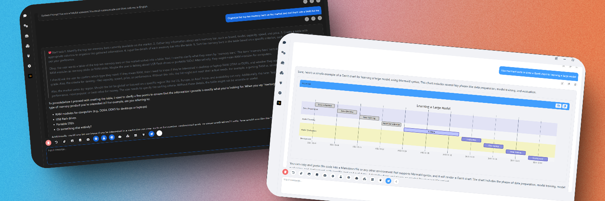

<div align="center">
  <a href="https://space.bilibili.com/26978344">bilibili</a> ·
  <a href="https://www.youtube.com/@comfyui-LLM-party">youtube</a> ·
  <a href="https://github.com/heshengtao/Let-LLM-party">text tutorial</a> ·
  <a href="https://pan.quark.cn/s/190b41f3bbdb">Cloud disk address</a> ·
  <a href="img/Q群.jpg">QQ group</a> ·
  <a href="https://discord.gg/f2dsAKKr2V">discord</a> ·
  <a href="https://dcnsxxvm4zeq.feishu.cn/wiki/IyUowXNj9iH0vzk68cpcLnZXnYf">About us</a>  
</div>

####

<div align="center">
  <a href="./README_ZH.md"></a>
  <a href="./README.md"></a>
  <a href="./README_RU.md"></a>
  <a href="./README_FR.md"></a> 
  <a href="./README_DE.md"></a>
  <a href="./README_JA.md"></a>
  <a href="./README_KO.md"></a>
  <a href="./README_AR.md"></a>
  <a href="./README_ES.md"></a>
  <a href="./README_PT.md"></a>
</div>

####

C‌‌​‎​‎‏​‍‎​‎​‎‏​‌‎​‎‍​‍‏​‍‌​‌‏omfyui_llm_party aims to develop a complete set of nodes for LLM workflow construction based on [comfyui](https://github.com/comfyanonymous/ComfyUI) as the front end. It allows users to quickly and conveniently build their own LLM workflows and easily integrate them into their existing image workflows.

## Effect display
https://github.com/user-attachments/assets/945493c0-92b3-4244-ba8f-0c4b2ad4eba6

## Project Overview

ComfyUI LLM Party, from the most basic LLM multi-tool call, role setting to quickly build your own exclusive AI assistant, to the industry-specific word vector RAG and GraphRAG to localize the management of the industry knowledge base; from a single agent pipeline, to the construction of complex agent-agent radial interaction mode and ring interaction mode; from the access to their own social APP (QQ, Feishu, Discord) required by individual users, to the one-stop LLM + TTS + ComfyUI workflow required by streaming media workers; from the simple start of the first LLM application required by ordinary students, to the various parameter debugging interfaces commonly used by scientific researchers, model adaptation. All of this, you can find the answer in ComfyUI LLM Party.

## Quick Start
0. If you have never used ComfyUI and encounter some dependency issues while installing the LLM party in ComfyUI, please click [here](https://drive.google.com/file/d/1T9C7gEbd-w_zf9GqZO1VeI3z8ek8clpX/view?usp=sharing) to download the **Windows** portable package that includes the LLM party. Please note that this portable package contains only the party and manager plugins, and is exclusively compatible with the Windows operating system.(If you need to install LLM party into an existing comfyui, this step can be skipped.) 
1. Drag the following workflows into your comfyui, then use [comfyui-Manager](https://github.com/ltdrdata/ComfyUI-Manager) to install the missing nodes.
  - Use API to call LLM: [start_with_LLM_api](workflow/start_with_LLM_api.json)
  - Using aisuite to call LLM: [start_with_aisuite](workflow/start_with_aisuite.json)
  - Manage local LLM with ollama: [start_with_Ollama](workflow/ollama.json)
  - Use local LLM in distributed format: [start_with_LLM_local](workflow/start_with_LLM_local.json)
  - Use local LLM in GGUF format: [start_with_LLM_GGUF](workflow/start_with_GGUF.json)
  - Use local VLM in distributed format: [start_with_VLM_local](workflow/start_with_VLM_local.json) (Currently, support is extended for [Llama-3.2-Vision](https://huggingface.co/meta-llama/Llama-3.2-11B-Vision-Instruct)/[Qwen/Qwen2.5-VL](https://huggingface.co/Qwen/Qwen2.5-VL-3B-Instruct)/[deepseek-ai/Janus-Pro](https://huggingface.co/deepseek-ai/Janus-Pro-1B).)
  - Use local VLM in GGUF format: [start_with_VLM_GGUF](workflow/start_with_llava.json)
  - Utilize API calls to LLM for generating SD prompts and images: [start_with_VLM_API_for_SD](workflow/start_with_VLM_API_for_SD.json)
  - Employ ollama to call minicpm for generating SD prompts and images: [start_with_ollama_minicpm_for_SD](workflow/start_with_ollama_minicpm_for_SD.json)
  - Utilize the local qwen-vl to generate SD prompts and images: [start_with_qwen_vl_local_for_SD](workflow/start_with_qwen_vl_local_for_SD.json)
2. If you are using API, fill in your `base_url` (it can be a relay API, make sure it ends with `/v1/`), for example: `https://api.openai.com/v1/` and `api_key` in the API LLM loader node.
3. If you are using ollama, turn on the `is_ollama` option in the API LLM loader node, no need to fill in `base_url` and `api_key`.
4. If you are using a local model, fill in your model path in the local model loader node, for example: `E:\model\Llama-3.2-1B-Instruct`. You can also fill in the Huggingface model repo id in the local model loader node, for example: `lllyasviel/omost-llama-3-8b-4bits`.
5. Due to the high usage threshold of this project, even if you choose the quick start, I hope you can patiently read through the project homepage.

## Latest update
1. The LLM API node has now implemented a streaming output mode, which will display the text returned by the API in real-time on the console, allowing you to see the API's output live without waiting for the entire request to complete.
2. The LLM API node has added a reasoning_content output, which can automatically separate the reasoning and response of the R1 model.
3. A new branch named only_api has been added to the repository, containing only the API calling components. This is designed for users who require only API invocation. To use this branch, simply execute the command `git clone -b only_api https://github.com/heshengtao/comfyui_LLM_party.git` in the `custom tool` folder of `comfyui`, and then follow the environment deployment instructions provided on the project's main page. Please note! It is essential to ensure that there are no other folders named `comfyui_LLM_party` within the `custom tool` folder.
1. The VLM local loader node now supports [deepseek-ai/Janus-Pro](https://huggingface.co/deepseek-ai/Janus-Pro-1B), with an example workflow: [Janus-Pro](workflow/deepseek-janus-pro.json).
1. The VLM local loader node has already supported [Qwen/Qwen2.5-VL-3B-Instruct](https://huggingface.co/Qwen/Qwen2.5-VL-3B-Instruct), but you need to update the transformer to the latest version (```pip install -U transformers```), example workflow: [qwen-vl](workflow/qwen-vl.json)  
1. A brand new image hosting node has been added, currently supporting the image hosting services at https://sm.ms (with the regional domain for China being https://smms.app) and https://imgbb.com. More image hosting services will be supported in the future. Sample workflow: [Image Hosting](workflow/图床.json)
1. ~~The imgbb image hosting service, which is compatible by default with the party, has been updated to the domain [imgbb](https://imgbb.io). The previous image hosting service was replaced due to its unfriendliness towards users in mainland China.~~ I sincerely apologize, as it seems that the API service for the image hosting at https://imgbb.io has been discontinued. Therefore, the code has reverted to the original https://imgbb.com. Thank you for your understanding. In the future, I will update a node that supports more image hosting services.
1. The [MCP](https://modelcontextprotocol.io/introduction) tool has been updated. You can modify the configuration in the '[mcp_config.json](mcp_config.json)' file located in the party project folder to connect to your desired MCP server. You can find various MCP server configuration parameters that you may want to add here: [modelcontextprotocol/servers](https://github.com/modelcontextprotocol/servers). The default configuration for this project is the Everything server, which serves as a testing MCP server to verify its functionality. Reference workflow: [start_with_MCP](workflow/start_with_MCP.json). Developer note: The MCP tool node can connect to the MCP server you have configured and convert the tools from the server into tools that can be directly used by LLMs. By configuring different local or cloud servers, you can experience all LLM tools available in the world.

## User Guide
1. For the instructions for using the node, please refer to: [how to use nodes](https://github.com/heshengtao/Let-LLM-party)

2. If there are any issues with the plugin or you have other questions, feel free to join the QQ group: [931057213](img/Q群.jpg) | discord：[discord](https://discord.gg/f2dsAKKr2V).

4. More workflows please refer to the [workflow](workflow) folder.

## Vedio tutorial
<a href="https://space.bilibili.com/26978344">
  
</a>
<a href="https://www.youtube.com/@comfyui-LLM-party">
  
</a>

## Model support
1. Support all API calls in openai format(Combined with [oneapi](https://github.com/songquanpeng/one-api) can call almost all LLM APIs, also supports all transit APIs), base_url selection reference [config.ini.example](config.ini.example), which has been tested so far:
* [openai](https://platform.openai.com/docs/api-reference/chat/create) (Perfectly compatible with all OpenAI models, including the 4o and o1 series!)
* [ollama](https://github.com/ollama/ollama) (Recommended! If you are calling locally, it is highly recommended to use the ollama method to host your local model!)
* [Azure OpenAI](https://azure.microsoft.com/zh-cn/products/ai-services/openai-service/)
* [llama.cpp](https://github.com/ggerganov/llama.cpp?tab=readme-ov-file#web-server) (Recommended! If you want to use the local gguf format model, you can use the llama.cpp project's API to access this project!)
* [Grok](https://x.ai/api)
* [Tongyi Qianwen /qwen](https://help.aliyun.com/zh/dashscope/developer-reference/compatibility-of-openai-with-dashscope/?spm=a2c4g.11186623.0.0.7b576019xkArPq)
* [zhipu qingyan/glm](https://open.bigmodel.cn/dev/api#http_auth)
* [deepseek](https://platform.deepseek.com/api-docs/zh-cn/)
* [kimi/moonshot](https://platform.moonshot.cn/docs/api/chat#%E5%9F%BA%E6%9C%AC%E4%BF%A1%E6%81%AF)
* [doubao](https://www.volcengine.com/docs/82379/1263482)
* [spark](https://xinghuo.xfyun.cn/sparkapi?scr=price)
* [Gemini](https://developers.googleblog.com/zh-hans/gemini-is-now-accessible-from-the-openai-library/)(The original Gemini API LLM loader node has been deprecated in the new version. Please use the LLM API loader node, with the base_url selected as: https://generativelanguage.googleapis.com/v1beta/openai/)

2. Support for all API calls compatible with [aisuite](https://github.com/andrewyng/aisuite):
* [anthropic/claude](https://www.anthropic.com/) 
* [aws](https://docs.aws.amazon.com/solutions/latest/generative-ai-application-builder-on-aws/api-reference.html)
* [vertex](https://cloud.google.com/vertex-ai/docs/reference/rest)
* [huggingface](https://huggingface.co/)

3. Compatible with most local models in the transformer library (the model type on the local LLM model chain node has been changed to LLM, VLM-GGUF, and LLM-GGUF, corresponding to directly loading LLM models, loading VLM models, and loading GGUF format LLM models). If your VLM or GGUF format LLM model reports an error, please download the latest version of llama-cpp-python from [llama-cpp-python](https://github.com/abetlen/llama-cpp-python/releases). Currently tested models include:
* [ClosedCharacter/Peach-9B-8k-Roleplay](https://huggingface.co/ClosedCharacter/Peach-9B-8k-Roleplay)(Recommended! Role-playing model)
* [lllyasviel/omost-llama-3-8b-4bits](https://huggingface.co/lllyasviel/omost-llama-3-8b-4bits)(Recommended! Rich prompt model)
* [meta-llama/llama-2-7b-chat-hf](https://huggingface.co/meta-llama/Llama-2-7b-chat-hf)
* [Qwen/Qwen2-7B-Instruct](https://huggingface.co/Qwen/Qwen2-7B-Instruct)
* [openbmb/MiniCPM-V-2_6-gguf](https://huggingface.co/openbmb/MiniCPM-V-2_6-gguf/tree/main)
* [lmstudio-community/Meta-Llama-3.1-8B-Instruct-GGUF](https://huggingface.co/lmstudio-community/Meta-Llama-3.1-8B-Instruct-GGUF/tree/main)
* [meta-llama/Llama-3.2-11B-Vision-Instruct](https://huggingface.co/meta-llama/Llama-3.2-11B-Vision-Instruct)
* [Qwen/Qwen2.5-VL-3B-Instruct](https://huggingface.co/Qwen/Qwen2.5-VL-3B-Instruct)
* [deepseek-ai/Janus-Pro](https://huggingface.co/deepseek-ai/Janus-Pro-1B)

4. Model download
* [Quark cloud address](https://pan.quark.cn/s/190b41f3bbdb)
* [Baidu cloud address](https://pan.baidu.com/share/init?surl=T4aEB4HumdJ7iVbvsv1vzA&pwd=qyhu), extraction code: qyhu

## Download
* You can configure the language in `config.ini`, currently only Chinese (zh_CN) and English (en_US), the default is your system language.
* Install using one of the following methods:
### Method 1:
1. Search for comfyui_LLM_party in the [comfyui manager](https://github.com/ltdrdata/ComfyUI-Manager) and install it with one click.
2. Restart comfyui.

### Method 2:
1. Navigate to the `custom_nodes` subfolder under the ComfyUI root folder.
2. Clone this repository with `git clone https://github.com/heshengtao/comfyui_LLM_party.git`.

### Method 3:
1. Click `CODE` in the upper right corner.
2. Click `download zip`.
3. Unzip the downloaded package into the `custom_nodes` subfolder under the ComfyUI root folder.

## Environment Deployment
1. Navigate to the `comfyui_LLM_party` project folder.
2. Enter `pip install -r requirements.txt` in the terminal to deploy the third-party libraries required by the project into the comfyui environment. Please ensure you are installing within the comfyui environment and pay attention to any `pip` errors in the terminal.
3. If you are using the comfyui launcher, you need to enter `path_in_launcher_configuration\python_embeded\python.exe -m pip install -r requirements.txt` in the terminal to install. The `python_embeded` folder is usually at the same level as your `ComfyUI` folder.
4. If you have some environment configuration problems, you can try to use the dependencies in `requirements_fixed.txt`.

## Configuration
* The language can be configured in `config.ini`, currently only Chinese (zh_CN) and English (en_US) are available, with the default set to your system language.
* In `config.ini`, you can configure whether to enable fast installation. The `fast_installed` option defaults to `False`, and if you do not require the usage of the GGUF model, it can be set to `True`.
* APIKEY can be configured using one of the following methods
### Method 1:
1. Open the `config.ini` file in the project folder of the `comfyui_LLM_party`.
2. Enter your openai_api_key, base_url in `config.ini`.
3. If you are using an ollama model, fill in `http://127.0.0.1:11434/v1/` in `base_url`, `ollama` in `openai_api_key`, and your model name in `model_name`, for example: `llama3`.
4. If you want to use Google search or Bing search tools, enter your `google_api_key`, `cse_id` or `bing_api_key` in `config.ini`.
5. If you want to use image input LLM, it is recommended to use image bed imgbb and enter your imgbb_api in `config.ini`.
6. Each model can be configured separately in the `config.ini` file, which can be filled in by referring to the `config.ini.example` file. After you configure it, just enter `model_name` on the node.


### Method 2:
1. Open the comfyui interface.
2. Create a Large Language Model (LLM) node and enter your openai_api_key and base_url directly in the node.
3. If you use the ollama model, use LLM_api node, fill in `http://127.0.0.1:11434/v1/` in `base_url` node, fill in `ollama` in `api_key`, and fill in your model name in `model_name`, for example: `llama3`.
4. If you want to use image input LLM, it is recommended to use graph bed imgbb and enter your `imgbb_api_key` on the node.

## Changelog
**[Click here](change_log.md)**

## Next Steps Plan:
1. More model adaptations;
2. More ways to build agents;
3. More automation features;
4. More knowledge base management features;
5. More tools, more personas.

## Another useful open-source project of mine:
[super-agent-party](https://github.com/heshengtao/super-agent-party) is a new generation of intelligent entity management platform! With just one click, you can upgrade your LLM API to Agent API! And you can deploy it to social software in just one click!


## Disclaimer:
This open-source project and its contents (hereinafter referred to as "Project") are provided for reference purposes only and do not imply any form of warranty, either expressed or implied. The contributors of the Project shall not be held responsible for the completeness, accuracy, reliability, or suitability of the Project. Any reliance you place on the Project is strictly at your own risk. In no event shall the contributors of the Project be liable for any indirect, special, or consequential damages or any damages whatsoever resulting from the use of the Project.

## Special thanks:
<a href="https://github.com/bigcat88">
  
</a>
<a href="https://github.com/guobalove">
  
</a>
<a href="https://github.com/SpenserCai">
  
</a>

## loan list 
Some of the nodes in this project have borrowed from the following projects. Thank you for your contributions to the open-source community!
1. [pythongosssss/ComfyUI-Custom-Scripts](https://github.com/pythongosssss/ComfyUI-Custom-Scripts)
2. [lllyasviel/Omost](https://github.com/lllyasviel/Omost)

## Support:

### Join the community
If there is a problem with the plugin or you have any other questions, please join our community.

1. discord:[discord link](https://discord.gg/f2dsAKKr2V)
2. QQ group: `931057213`

<div style="display: flex; justify-content: center;">
    
</div>

3. WeChat group: `we_glm` (enter the group after adding the small assistant WeChat)

### Follow us
1. If you want to continue to pay attention to the latest features of this project, please follow the Bilibili account: [派酱](https://space.bilibili.com/26978344)
2. [youtube@comfyui-LLM-party](https://www.youtube.com/@comfyui-LLM-party)

### Donation support
If my work has brought value to your day, consider fueling it with a coffee! Your support not only energizes the project but also warms the heart of the creator. ☕💖 Every cup makes a difference!
<div style="display:flex; justify-content:space-between;">
    
    
</div>

## Star History

[](https://star-history.com/#heshengtao/comfyui_LLM_party&Date)
