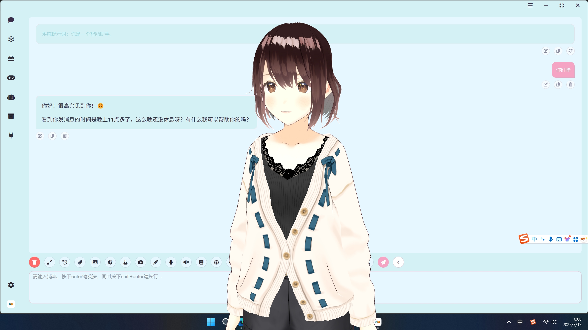

<div align="center">
  <a href="https://space.bilibili.com/26978344">bilibili</a> ·
  <a href="https://www.youtube.com/@LLM-party">youtube</a> ·
  <a href="https://github.com/heshengtao/Let-LLM-party">Tutorial escrito</a> ·
  <a href="https://pan.quark.cn/s/190b41f3bbdb">Dirección de disco en la nube</a> ·
  <a href="img/Q群.jpg">Grupo QQ</a> ·
  <a href="https://discord.gg/f2dsAKKr2V">Discord</a> ·
  <a href="https://dcnsxxvm4zeq.feishu.cn/wiki/IyUowXNj9iH0vzk68cpcLnZXnYf">Sobre nosotros</a>
</div>

####

<div align="center">
  <a href="./README_ZH.md"></a>
  <a href="./README.md"></a>
  <a href="./README_RU.md"></a>
  <a href="./README_FR.md"></a> 
  <a href="./README_DE.md"></a>
  <a href="./README_JA.md"></a>
  <a href="./README_KO.md"></a>
  <a href="./README_AR.md"></a>
  <a href="./README_ES.md"></a>
  <a href="./README_PT.md"></a>
</div>

####

Comfyui_llm_party tiene la intención de desarrollar una biblioteca completa de nodos para la construcción de flujos de trabajo de LLM, basada en la interfaz de usuario extremadamente simple de [comfyui](https://github.com/comfyanonymous/ComfyUI) como frontend. Esto permitirá a los usuarios construir sus flujos de trabajo de LLM de manera más rápida y conveniente, además de facilitar la integración de sus flujos de trabajo de imágenes.

## Demostración de resultados
https://github.com/user-attachments/assets/945493c0-92b3-4244-ba8f-0c4b2ad4eba6

## Resumen del Proyecto
ComfyUI LLM Party permite desde la llamada a múltiples herramientas LLM desde la base, la rápida configuración de un asistente AI personalizado, hasta la implementación de vectores de palabras RAG y GraphRAG para la gestión local de bases de datos de conocimiento en la industria; desde una simple línea de agentes inteligentes hasta la construcción de complejos modos de interacción radial entre agentes inteligentes y modos de interacción en círculo; desde la integración de aplicaciones sociales (QQ, Feishu, Discord) para usuarios individuales, hasta un flujo de trabajo integral de LLM+TTS+ComfyUI para trabajadores de streaming; desde el inicio sencillo que necesita un estudiante común con su primera aplicación LLM, hasta las diversas interfaces de ajuste de parámetros frecuentemente utilizadas por investigadores. Todo esto lo puedes encontrar en ComfyUI LLM Party.

## Inicio rápido
0. Si nunca has utilizado ComfyUI y al instalar LLM party en ComfyUI has encontrado algunos problemas de dependencia, haz clic [aquí](https://drive.google.com/file/d/1T9C7gEbd-w_zf9GqZO1VeI3z8ek8clpX/view?usp=sharing) para descargar el paquete portátil de ComfyUI **windows** que incluye LLM party. ¡Atención! Este paquete portátil contiene únicamente los dos plugins: party y manager, y es exclusivamente para sistemas Windows.(En caso de que necesite instalar LLM party en un comfyui existente, este paso se puede omitir.)  
1. Arrastra los siguientes flujos de trabajo a tu comfyui, luego usa [comfyui-Manager](https://github.com/ltdrdata/ComfyUI-Manager) para instalar los nodos faltantes.
  - Usa la API para llamar a LLM: [start_with_LLM_api](workflow/start_with_LLM_api.json)
  - Llamando a LLM con aisuite: [iniciar_con_aisuite](workflow/start_with_aisuite.json)
  - Gestiona LLM local con ollama: [start_with_Ollama](workflow/ollama.json)
  - Usa LLM local en formato distribuido: [start_with_LLM_local](workflow/start_with_LLM_local.json)
  - Usa LLM local en formato GGUF: [start_with_LLM_GGUF](workflow/start_with_GGUF.json)
  - Usa VLM local en formato distribuido: [start_with_VLM_local](workflow/start_with_VLM_local.json) Actualmente se admite [Llama-3.2-Vision](https://huggingface.co/meta-llama/Llama-3.2-11B-Vision-Instruct)/[Qwen/Qwen2.5-VL](https://huggingface.co/Qwen/Qwen2.5-VL-3B-Instruct)/[deepseek-ai/Janus-Pro](https://huggingface.co/deepseek-ai/Janus-Pro-1B)
  - Usa VLM local en formato GGUF: [start_with_VLM_GGUF](workflow/start_with_llava.json)
  - Utilizar la API para invocar LLM y generar palabras clave para SD, así como para crear imágenes: [start_with_VLM_API_for_SD](workflow/start_with_VLM_API_for_SD.json)
  - Utilizar ollama para invocar minicpm y generar palabras clave para SD, así como para crear imágenes: [start_with_ollama_minicpm_for_SD](workflow/start_with_ollama_minicpm_for_SD.json)
  - Utilizar el qwen-vl local para generar palabras clave para SD y crear imágenes: [start_with_qwen_vl_local_for_SD](workflow/start_with_qwen_vl_local_for_SD.json) 
2. Si estás usando la API, completa tu `base_url` (puede ser una API de retransmisión, asegúrate de que termine con `/v1/`) y `api_key` en el nodo de carga de API LLM. Ejemplo: `https://api.openai.com/v1/`
3. Si estás usando ollama, activa la opción `is_ollama` en el nodo de carga de API LLM, no es necesario completar `base_url` y `api_key`.
4. Si estás usando un modelo local, completa la ruta de tu modelo en el nodo de carga del modelo local, por ejemplo: `E:\model\Llama-3.2-1B-Instruct`. También puedes completar el ID del repositorio del modelo en Huggingface en el nodo de carga del modelo local, por ejemplo: `lllyasviel/omost-llama-3-8b-4bits`.
5. Debido al alto umbral de uso de este proyecto, incluso si eliges el inicio rápido, espero que puedas leer pacientemente la página principal del proyecto.

## Últimas Actualizaciones
1. El nodo LLM API ahora admite el modo de salida en streaming, que mostrará en la consola el texto devuelto por la API en tiempo real, permitiéndole ver la salida de la API sin tener que esperar a que se complete toda la solicitud.
2. Se ha añadido la salida reasoning_content al nodo LLM API, lo que permite separar automáticamente el razonamiento y la respuesta del modelo R1.
3. Se ha creado una nueva rama del repositorio llamada only_api, que contiene solo la parte de la llamada a la API. Esto facilita a los usuarios que solo necesitan realizar llamadas a la API, sólo deben utilizar el comando `git clone -b only_api https://github.com/heshengtao/comfyui_LLM_party.git` en la carpeta `custom node` de `comfyui`, y luego seguir el plan de despliegue del entorno de la página principal de este proyecto para poder utilizar esta rama. ¡Atención! Si necesita asegurarse de que no haya otra carpeta llamada `comfyui_LLM_party` en la carpeta `custom node`.
1. El nodo cargador local de VLM ya admite [deepseek-ai/Janus-Pro](https://huggingface.co/deepseek-ai/Janus-Pro-1B), flujo de trabajo de ejemplo: [Janus-Pro](workflow/deepseek-janus-pro.json)  
1. El nodo de cargador local VLM ya es compatible con [Qwen/Qwen2.5-VL-3B-Instruct](https://huggingface.co/Qwen/Qwen2.5-VL-3B-Instruct), pero debe actualizar el transformador a la versión más reciente (```pip install -U transformers```), flujo de trabajo de ejemplo: [qwen-vl](workflow/qwen-vl.json) 
1. Se ha añadido un nuevo nodo de alojamiento de imágenes, que actualmente admite el alojamiento de imágenes de https://sm.ms (el dominio en la región de China es https://smms.app) y https://imgbb.com. En el futuro, se admitirán más alojamientos de imágenes. Ejemplo de flujo de trabajo: [Alojamiento de imágenes](workflow/图床.json)  
1. ~~El servicio de alojamiento de imágenes imgbb, que es compatible de manera predeterminada con party, se ha actualizado al dominio [imgbb](https://imgbb.io). El alojamiento anterior no era amigable para los usuarios de China continental, por lo que se ha cambiado.~~ Lamento informar que el servicio API de alojamiento de imágenes en https://imgbb.io parece haber sido descontinuado, por lo que el código ha vuelto a la original https://imgbb.com. Agradezco su comprensión. En el futuro, actualizaré un nodo que soporte más servicios de alojamiento de imágenes. 
1. Se ha actualizado la herramienta [MCP](https://modelcontextprotocol.io/introduction), puedes modificar la configuración en el archivo '[mcp_config.json](mcp_config.json)' en la carpeta del proyecto party para ajustar el servidor MCP al que deseas conectarte. Puedes encontrar varios parámetros de configuración de servidores MCP que deseas agregar aquí: [modelcontextprotocol/servers](https://github.com/modelcontextprotocol/servers). La configuración predeterminada de este proyecto es el servidor Everything, un servidor destinado a probar si el servidor MCP funciona correctamente. Flujo de trabajo de referencia: [start_with_MCP](workflow/start_with_MCP.json). Nota para desarrolladores: el nodo de la herramienta MCP puede conectarse al servidor MCP configurado y luego convertir las herramientas del servidor en herramientas que el LLM pueda utilizar directamente. Al configurar diferentes servidores locales o en la nube, puedes experimentar todas las herramientas LLM disponibles en el mundo.

## Instrucciones de Uso
1. Para las instrucciones de uso de los nodos, consulta: [怎么使用节点](https://github.com/heshengtao/Let-LLM-party)

2. Si hay problemas con el plugin o tienes otras dudas, no dudes en unirte a nuestro grupo de QQ: [931057213](img/Q群.jpg) | discord：[discord](https://discord.gg/f2dsAKKr2V).

4. Para más flujos de trabajo, puede consultar la carpeta [workflow](workflow).

## Tutoriales en video
<a href="https://space.bilibili.com/26978344">
  
</a>
<a href="https://www.youtube.com/@LLM-party">
  
</a>

## Soporte de Modelos
1. Se admiten todas las llamadas a la API en formato OpenAI (en combinación con [oneapi](https://github.com/songquanpeng/one-api) se pueden realizar llamadas a casi todas las API de LLM, también se admiten todas las API de retransmisión), para la elección de base_url, consulte [config.ini.example](config.ini.example). Actualmente se han probado las siguientes:
* [openai](https://platform.openai.com/docs/api-reference/chat/create) (¡Perfectamente compatible con todos los modelos de OpenAI, incluidas las series 4o y o1!)
* [ollama](https://github.com/ollama/ollama) (¡Recomendado! Si estás llamando localmente, se recomienda encarecidamente utilizar el método ollama para alojar tu modelo local!)
* [Azure OpenAI](https://azure.microsoft.com/zh-cn/products/ai-services/openai-service/)
* [llama.cpp](https://github.com/ggerganov/llama.cpp?tab=readme-ov-file#web-server) (¡Recomendado! Si deseas utilizar el modelo en formato gguf local, puedes utilizar la API del proyecto llama.cpp para acceder a este proyecto!)
* [Grok](https://x.ai/api)
* [通义千问/qwen](https://help.aliyun.com/zh/dashscope/developer-reference/compatibility-of-openai-with-dashscope/?spm=a2c4g.11186623.0.0.7b576019xkArPq)
* [智谱清言/glm](https://open.bigmodel.cn/dev/api#http_auth)
* [deepseek](https://platform.deepseek.com/api-docs/zh-cn/)
* [kimi/moonshot](https://platform.moonshot.cn/docs/api/chat#%E5%9F%BA%E6%9C%AC%E4%BF%A1%E6%81%AF)
* [doubao](https://www.volcengine.com/docs/82379/1263482)
* [讯飞星火/spark](https://xinghuo.xfyun.cn/sparkapi?scr=price)
* [Gemini](https://developers.googleblog.com/zh-hans/gemini-is-now-accessible-from-the-openai-library/)(El nodo cargador de la API LLM original de Gemini ha sido descontinuado en la nueva versión, por favor utilice el nodo cargador de la API LLM, seleccionando base_url como: https://generativelanguage.googleapis.com/v1beta/openai/)

2. Soporte para todas las llamadas a la API compatibles con [aisuite](https://github.com/andrewyng/aisuite):
* [anthropic/claude](https://www.anthropic.com/)
* [aws](https://docs.aws.amazon.com/solutions/latest/generative-ai-application-builder-on-aws/api-reference.html)
* [vértice](https://cloud.google.com/vertex-ai/docs/reference/rest)
* [huggingface](https://huggingface.co/)

3. Compatible con la mayoría de los modelos locales en la biblioteca transformer (el tipo de modelo en el nodo de la cadena de modelos LLM local se ha cambiado a LLM, VLM-GGUF y LLM-GGUF, lo que corresponde a cargar directamente modelos LLM, cargar modelos VLM y cargar modelos LLM en formato GGUF). Si tu modelo LLM en formato VLM o GGUF informa un error, descarga la última versión de llama-cpp-python desde [llama-cpp-python](https://github.com/abetlen/llama-cpp-python/releases). Los modelos actualmente probados incluyen:
* [ClosedCharacter/Peach-9B-8k-Roleplay](https://huggingface.co/ClosedCharacter/Peach-9B-8k-Roleplay) (¡Recomendado! Modelo de rol)
* [lllyasviel/omost-llama-3-8b-4bits](https://huggingface.co/lllyasviel/omost-llama-3-8b-4bits) (¡Recomendado! Modelo de palabras clave ricas)
* [meta-llama/Llama-2-7b-chat-hf](https://huggingface.co/meta-llama/Llama-2-7b-chat-hf)
* [Qwen/Qwen2-7B-Instruct](https://huggingface.co/Qwen/Qwen2-7B-Instruct)
* [openbmb/MiniCPM-V-2_6-gguf](https://huggingface.co/openbmb/MiniCPM-V-2_6-gguf/tree/main)
* [lmstudio-community/Meta-Llama-3.1-8B-Instruct-GGUF](https://huggingface.co/lmstudio-community/Meta-Llama-3.1-8B-Instruct-GGUF/tree/main)
* [meta-llama/Llama-3.2-11B-Vision-Instruct](https://huggingface.co/meta-llama/Llama-3.2-11B-Vision-Instruct)
* [Qwen/Qwen2.5-VL-3B-Instruct](https://huggingface.co/Qwen/Qwen2.5-VL-3B-Instruct)
* [deepseek-ai/Janus-Pro](https://huggingface.co/deepseek-ai/Janus-Pro-1B)

4. Descarga del modelo:
* [Dirección de nube Quark](https://pan.quark.cn/s/190b41f3bbdb)
* [Dirección de Baidu Cloud](https://pan.baidu.com/share/init?surl=T4aEB4HumdJ7iVbvsv1vzA&pwd=qyhu), código de extracción: qyhu

## Descarga
Instale utilizando uno de los siguientes métodos:
### Método Uno:
1. Busque `comfyui_LLM_party` en [el administrador de ComfyUI](https://github.com/ltdrdata/ComfyUI-Manager) e instálelo con un solo clic.
2. Reinicie ComfyUI.
### Método dos:
1. Navegue hasta la subcarpeta `custom_nodes` en la carpeta raíz de ComfyUI.
2. Clone este repositorio. `git clone https://github.com/heshengtao/comfyui_LLM_party.git`

### Método tres:
1. Haga clic en `CODE` en la esquina superior derecha.
2. Haga clic en `download zip`.
3. Extraiga el archivo comprimido descargado en la subcarpeta `custom_nodes` de la carpeta raíz de ComfyUI.

## Implementación del entorno
1. Navegue hasta la carpeta del proyecto `comfyui_LLM_party`.
2. En la terminal, ingrese `pip install -r requirements.txt` para implementar las bibliotecas de terceros necesarias para este proyecto en el entorno de comfyui. Tenga en cuenta si está instalando en el entorno de comfyui y preste atención a los errores de `pip` en la terminal.
3. Si está utilizando el lanzador de comfyui, deberá ingresar en la terminal `ruta en la configuración del lanzador\python_embeded\python.exe -m pip install -r requirements.txt` para realizar la instalación. La carpeta `python_embeded` generalmente está al mismo nivel que su carpeta `ComfyUI`.
4. Si encuentra problemas con la configuración del entorno, puede intentar usar las dependencias del archivo `requirements_fixed.txt`.
## Configuración
* Se puede configurar el idioma en `config.ini`, actualmente solo hay dos opciones: chino (zh_CN) e inglés (en_US), siendo el idioma predeterminado el de tu sistema.
* Se puede configurar en `config.ini` si se desea una instalación rápida; `fast_installed` está configurado por defecto como `False`. Si no necesitas utilizar el modelo GGUF, puedes establecerlo en `True`.
* Puede utilizar uno de los siguientes métodos para configurar el APIKEY.
### Método uno:
1. Abra el archivo `config.ini` en la carpeta del proyecto `comfyui_LLM_party`.
2. Ingrese su `openai_api_key` y `base_url` en `config.ini`.
3. Si utiliza el modelo ollama, ingrese `http://127.0.0.1:11434/v1/` en `base_url`, `ollama` en `openai_api_key`, y el nombre de su modelo en `model_name`, por ejemplo: llama3.
4. Si desea utilizar herramientas de búsqueda de Google o Bing, ingrese su `google_api_key`, `cse_id` o `bing_api_key` en `config.ini`.
5. Si desea utilizar entrada de imágenes para LLM, se recomienda usar el servicio de alojamiento de imágenes imgbb, ingresando su `imgbb_api` en `config.ini`.
6. Cada modelo se puede configurar individualmente en el archivo `config.ini`, y puede consultar el archivo `config.ini.example` para completar la configuración. Una vez que esté configurado, solo necesita ingresar `model_name` en el nodo.

### Método dos:
1. Abra la interfaz de comfyui.
2. Cree un nuevo nodo de modelo de lenguaje grande (LLM), ingresando directamente su `openai_api_key` y `base_url` en el nodo.
3. Si utiliza el modelo ollama, utilice el nodo LLM_api, ingresando `http://127.0.0.1:11434/v1/` en `base_url`, `ollama` en `api_key`, y el nombre de su modelo en `model_name`, por ejemplo: llama3.
4. Si desea utilizar entrada de imágenes para LLM, se recomienda usar el servicio de alojamiento de imágenes imgbb, ingresando su `imgbb_api_key` en el nodo.

## Registro de Actualizaciones
**[Click here](change_log.md)**

## Plan de acción siguiente:
1. Más adaptaciones de modelos;
2. Más formas de construir agentes;
3. Más funciones de automatización;
4. Más funciones de gestión de bases de conocimiento;
5. Más herramientas, más personajes.

## Otro proyecto de código abierto útil mío:
[super-agent-party](https://github.com/heshengtao/super-agent-party) es una aplicación de compañero de escritorio en 3D con IA que ofrece posibilidades infinitas. ¡Ya incluye soporte para RAG, búsqueda en la web, memoria a largo plazo, intérprete de código, MCP, A2A, Comfyui, bots de QQ y muchas más funciones!


## Aviso legal:
Este proyecto de código abierto y su contenido (en adelante, "el proyecto") son solo para fines de referencia y no implican ninguna garantía expresa o implícita. Los contribuyentes del proyecto no asumen ninguna responsabilidad por la integridad, precisión, fiabilidad o aplicabilidad del proyecto. Cualquier acción que dependa del contenido del proyecto debe asumir el riesgo por su cuenta. En ningún caso, los contribuyentes del proyecto serán responsables de cualquier pérdida o daño indirecto, especial o incidental que surja del uso del contenido del proyecto.
## Agradecimientos especiales
<a href="https://github.com/bigcat88">
  
</a>
<a href="https://github.com/guobalove">
  
</a>
<a href="https://github.com/SpenserCai">
  
</a>

## Lista de proyectos referenciados
Algunos nodos en este proyecto se han inspirado en los siguientes proyectos. ¡Agradecemos su contribución a la comunidad de código abierto!
1. [pythongosssss/ComfyUI-Custom-Scripts](https://github.com/pythongosssss/ComfyUI-Custom-Scripts)
2. [lllyasviel/Omost](https://github.com/lllyasviel/Omost)

## Soporte:

### Únete a la comunidad
Si hay problemas con el complemento o si tiene alguna otra pregunta, le damos la bienvenida a unirse a nuestra comunidad.

1. Grupo de QQ: `931057213`
<div style="display: flex; justify-content: center;">
    
</div>

2. Grupo de WeChat: `we_glm` (una vez que añada a la asistente de WeChat, podrá unirse al grupo)

3. Discord: [enlace de discord](https://discord.gg/f2dsAKKr2V)

### Síguenos
1. Si desea mantenerse informado sobre las últimas funciones de este proyecto, le invitamos a seguir nuestra cuenta de Bilibili: [派酱](https://space.bilibili.com/26978344)
2. [youtube@LLM-party](https://www.youtube.com/@LLM-party)

## Historial de estrellas

[](https://star-history.com/#heshengtao/comfyui_LLM_party&Date)
