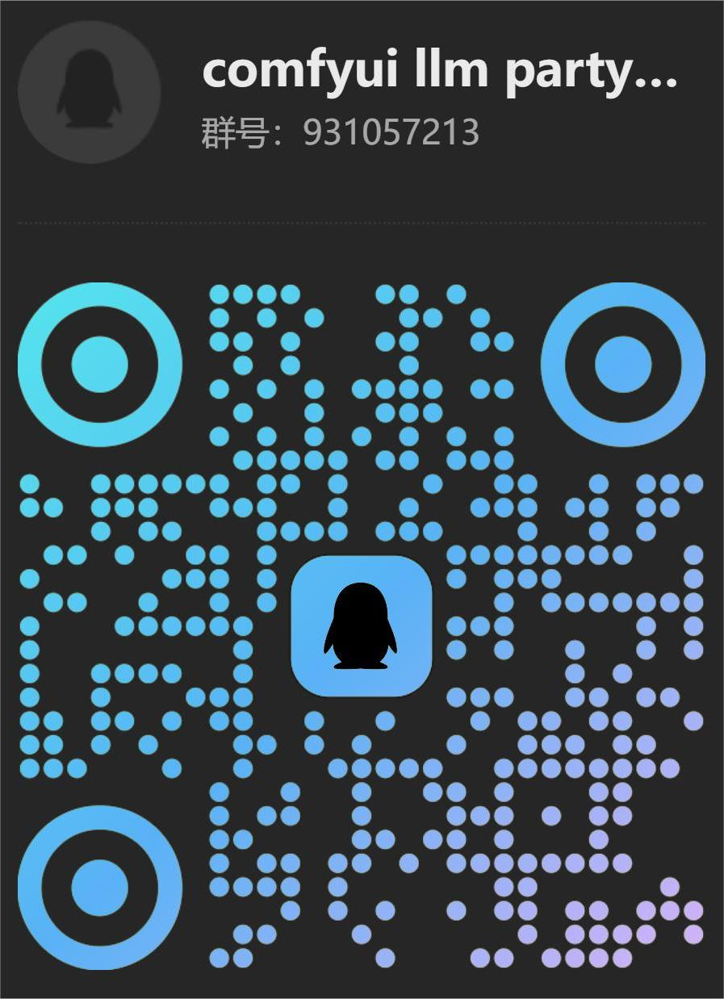

<div align="center">
  <a href="https://space.bilibili.com/26978344">bilibili</a> ·
  <a href="https://www.youtube.com/@comfyui-LLM-party">youtube</a> ·
  <a href="https://github.com/heshengtao/Let-LLM-party">텍스트 튜토리얼</a> ·
  <a href="https://pan.quark.cn/s/190b41f3bbdb">클라우드 디스크 주소</a> ·
  <a href="img/Q群.jpg">QQ 그룹</a> ·
  <a href="https://discord.gg/f2dsAKKr2V">디스코드</a> ·
  <a href="https://dcnsxxvm4zeq.feishu.cn/wiki/IyUowXNj9iH0vzk68cpcLnZXnYf">우리에 관하여</a>
</div>

####

<div align="center">
  <a href="./README_ZH.md"></a>
  <a href="./README.md"></a>
  <a href="./README_RU.md"></a>
  <a href="./README_FR.md"></a> 
  <a href="./README_DE.md"></a>
  <a href="./README_JA.md"></a>
  <a href="./README_KO.md"></a>
  <a href="./README_AR.md"></a>
  <a href="./README_ES.md"></a>
  <a href="./README_PT.md"></a>
</div>

####

Comfyui_llm_party는 [comfyui](https://github.com/comfyanonymous/ComfyUI)라는 매우 간단한 UI 인터페이스를 기반으로 LLM 작업 흐름 구축을 위한 완전한 노드 라이브러리를 개발하고자 합니다. 이를 통해 사용자는 자신의 LLM 작업 흐름을 더 편리하고 신속하게 구축할 수 있으며, 자신의 이미지 작업 흐름에 더 쉽게 통합할 수 있습니다.

## 효과 시연
https://github.com/user-attachments/assets/945493c0-92b3-4244-ba8f-0c4b2ad4eba6

## 프로젝트 개요
ComfyUI LLM Party는 가장 기본적인 LLM 다중 도구 호출, 역할 설정을 통해 나만의 AI 도우미를 신속하게 구축하고, 산업에 적용 가능한 단어 벡터 RAG, GraphRAG를 통해 산업 내 지식 관리 시스템을 로컬화합니다. 단일 지능체 파이프라인에서 복잡한 지능체 간의 방사형 상호작용 모드, 순환 상호작용 모드를 구성하는 것까지; 개인 사용자가 자신의 사회적 APP(QQ, Feishu, Discord)에 접속할 필요가 있는 것부터, 스트리밍 작업자가 필요로 하는 원스톱 LLM+TTS+ComfyUI 워크플로우까지; 일반 학생들이 필요로 하는 첫 번째 LLM 응용 프로그램의 간단한 시작부터, 연구자들이 자주 사용하는 다양한 파라미터 조정 인터페이스, 모델 적응까지. 이 모든 것을 ComfyUI LLM Party에서 확인할 수 있습니다.

## 빠른 시작
0. 만약 당신이 comfyu를 사용해 본 적이 없고, comfyui에서 LLM 파티를 설치할 때 의존성 문제가 발생했다면, [여기를 클릭](https://drive.google.com/file/d/1T9C7gEbd-w_zf9GqZO1VeI3z8ek8clpX/view?usp=sharing) 하여 LLM 파티가 포함된 comfyui **windows** 휴대용 패키지를 다운로드하십시오. 주의하십시오! 이 휴대용 패키지에는 party와 관리자라는 두 개의 플러그인만 포함되어 있으며, 오직 windows 시스템에만 적합합니다.(기존의 comfyui에 LLM party를 설치해야 하는 경우, 이 단계를 건너뛸 수 있습니다.)
1. 다음 워크플로를 comfyui에 드래그한 다음 [comfyui-Manager](https://github.com/ltdrdata/ComfyUI-Manager)를 사용하여 누락된 노드를 설치합니다.
  - API를 사용하여 LLM 호출: [start_with_LLM_api](workflow/start_with_LLM_api.json)
  - aisuite를 사용하여 LLM을 호출합니다：[start_with_aisuite](workflow/start_with_aisuite.json)
  - ollama를 사용하여 로컬 LLM 관리: [start_with_Ollama](workflow/ollama.json)
  - 분산 형식의 로컬 LLM 사용: [start_with_LLM_local](workflow/start_with_LLM_local.json)
  - GGUF 형식의 로컬 LLM 사용: [start_with_LLM_GGUF](workflow/start_with_GGUF.json)
  - 분산 형식의 로컬 VLM 사용: [start_with_VLM_local](workflow/start_with_VLM_local.json) (현재는 [Llama-3.2-Vision](https://huggingface.co/meta-llama/Llama-3.2-11B-Vision-Instruct)/[Qwen/Qwen2.5-VL](https://huggingface.co/Qwen/Qwen2.5-VL-3B-Instruct)/[deepseek-ai/Janus-Pro](https://huggingface.co/deepseek-ai/Janus-Pro-1B)을 지원하고 있습니다.)
  - GGUF 형식의 로컬 VLM 사용: [start_with_VLM_GGUF](workflow/start_with_llava.json)
  - API를 사용하여 LLM에 SD 프롬프트를 생성하고 이미지를 생성합니다: [start_with_VLM_API_for_SD](workflow/start_with_VLM_API_for_SD.json)
  - ollama를 사용하여 minicpm이 SD 프롬프트를 생성하고 이미지를 생성합니다: [start_with_ollama_minicpm_for_SD](workflow/start_with_ollama_minicpm_for_SD.json)
  - 로컬 qwen-vl을 사용하여 SD 프롬프트를 생성하고 이미지를 생성합니다: [start_with_qwen_vl_local_for_SD](workflow/start_with_qwen_vl_local_for_SD.json)
2. API를 사용하는 경우, API LLM 로더 노드에 `base_url`(릴레이 API일 수 있으며, 끝이 `/v1/`로 끝나는지 확인)과 `api_key`를 입력합니다. 예: `https://api.openai.com/v1/`
3. ollama를 사용하는 경우, API LLM 로더 노드에서 `is_ollama` 옵션을 켜고 `base_url` 및 `api_key`를 입력할 필요가 없습니다.
4. 로컬 모델을 사용하는 경우, 로컬 모델 로더 노드에 모델 경로를 입력합니다. 예: `E:\model\Llama-3.2-1B-Instruct`. 또한 로컬 모델 로더 노드에 Huggingface 모델 repo id를 입력할 수도 있습니다. 예: `lllyasviel/omost-llama-3-8b-4bits`
5. 이 프로젝트는 사용 임계값이 높기 때문에 빠른 시작을 선택하더라도 프로젝트 홈페이지를 꼼꼼히 읽어주시기 바랍니다.

## 최신 업데이트
1. LLM API 노드는 스트리밍 출력 모드를 지원하게 되며, 콘솔에서 API가 반환하는 텍스트를 실시간으로 스트리밍 표시할 수 있습니다. 이를 통해 요청이 완료될 때까지 기다리지 않고도 API의 출력을 즉시 확인할 수 있습니다.
2. LLM API 노드에 reasoning_content 출력이 추가되어 R1 모델의 reasoning과 response를 자동으로 분리할 수 있게 되었습니다.
3. only_api라는 리포지토리 브랜치가 새로 추가되었으며, 이 브랜치에는 API 호출 부분만 포함되어 있어 API 호출만 필요한 사용자에게 매우 편리합니다. `comfyui`의 `custom tool` 폴더에서 `git clone -b only_api https://github.com/heshengtao/comfyui_LLM_party.git` 명령어를 사용하신 후, 본 프로젝트의 홈페이지에 따라 환경을 구축하시면 이 브랜치를 사용할 수 있습니다. 주의! `custom tool` 폴더에 `comfyui_LLM_party`라는 다른 폴더가 존재하지 않도록 확인해 주시기 바랍니다.
1. VLM 로컬 로드 노드는 이미 [deepseek-ai/Janus-Pro](https://huggingface.co/deepseek-ai/Janus-Pro-1B)를 지원하고 있습니다. 예제 워크플로우: [Janus-Pro](workflow/deepseek-janus-pro.json)
1. VLM 로컬 로더 노드는 이미 [Qwen/Qwen2.5-VL-3B-Instruct](https://huggingface.co/Qwen/Qwen2.5-VL-3B-Instruct)를 지원하고 있으나, transformer를 최신 버전으로 업데이트해야 합니다（```pip install -U transformers```）。샘플 워크플로우：[qwen-vl](workflow/qwen-vl.json)
1. 새로운 이미지 호스팅 노드가 추가되었습니다. 현재 https://sm.ms 이미지 호스팅(중국 도메인은 https://smms.app)과 https://imgbb.com 이미지 호스팅을 지원하고 있습니다. 앞으로 더 많은 이미지 호스팅이 지원될 예정입니다. 예시 작업 흐름: [이미지 호스팅](workflow/图床.json)
1. ~~party 기본 호환 imgBB 이미지 호스팅이 [imgbb](https://imgbb.io) 이 도메인으로 업데이트되었습니다. 이전의 이미지 호스팅은 중국 본토 사용자에게 불편함이 있었기 때문에 변경되었습니다.~~ 대단히 죄송하지만,  https://imgbb.io 의 이미지 호스팅 API 서비스가 중단된 것 같습니다. 그래서 코드는 원래의 https://imgbb.com 으로 롤백되었습니다. 여러분의 이해에 감사드립니다. 앞으로 더 많은 이미지 호스팅을 지원하는 노드를 업데이트할 예정입니다.
1. [MCP](https://modelcontextprotocol.io/introduction) 도구가 업데이트되었습니다. party 프로젝트 폴더 아래의 '[mcp_config.json](mcp_config.json)' 파일에서 설정을 수정하여 연결하려는 MCP 서버를 조정할 수 있습니다. 추가하고자 하는 다양한 MCP 서버 구성 매개변수는 여기에서 확인할 수 있습니다: [modelcontextprotocol/servers](https://github.com/modelcontextprotocol/servers). 본 프로젝트의 기본 구성은 Everything 서버로, MCP 서버가 정상적으로 작동하는지 테스트하는 데 사용됩니다. 워크플로우 참조: [start_with_MCP](workflow/start_with_MCP.json). 개발자 주의사항: MCP 도구 노드는 구성된 MCP 서버에 연결할 수 있으며, 그 후 서버 내의 도구를 LLM이 직접 사용할 수 있는 도구로 변환합니다. 다양한 로컬 서버 또는 클라우드 서버를 구성함으로써 전 세계의 모든 LLM 도구를 체험할 수 있습니다.

## 사용 설명
1. 노드 사용 설명서는 다음을 참고하십시오: [노드 사용 방법](https://github.com/heshengtao/Let-LLM-party)

2. 플러그인에 문제가 있거나 다른 질문이 있으시면 QQ 그룹에 참여해 주십시오: [931057213](img/Q群.jpg) |discord：[discord](https://discord.gg/f2dsAKKr2V).

4. 더 많은 워크플로우는 [workflow](workflow) 폴더를 참조하시기 바랍니다.

## 비디오 튜토리얼
<a href="https://space.bilibili.com/26978344">
  
</a>
<a href="https://www.youtube.com/@comfyui-LLM-party">
  
</a>

## 모델 지원
1. 이미지에서 텍스트와 위치를 인식하기 위한 EasyOCR 노드를 추가했습니다. 해당 마스크를 생성하고 LLM이 볼 수 있도록 JSON 문자열을 반환할 수 있습니다. 표준 버전과 프리미엄 버전이 모두 제공됩니다!
2. 모든 OpenAI 형식의 API 호출을 지원합니다( [oneapi](https://github.com/songquanpeng/one-api)와 결합하면 거의 모든 LLM API를 호출할 수 있으며, 모든 중계 API도 지원합니다). base_url 선택은 [config.ini.example](config.ini.example)을 참조하시기 바랍니다. 현재 테스트된 항목은 다음과 같습니다:
* [openai](https://platform.openai.com/docs/api-reference/chat/create) (모든 OpenAI 모델과 완벽하게 호환되며, 4o 및 o1 시리즈를 포함합니다!)
* [ollama](https://github.com/ollama/ollama) (추천! 로컬에서 호출하는 경우, 로컬 모델을 호스팅하기 위해 ollama 방법을 사용하는 것이 강력히 권장됩니다!)
* [Azure OpenAI](https://azure.microsoft.com/zh-cn/products/ai-services/openai-service/)
* [llama.cpp](https://github.com/ggerganov/llama.cpp?tab=readme-ov-file#web-server) (추천! 로컬 gguf 형식 모델을 사용하려면 llama.cpp 프로젝트의 API를 사용하여 이 프로젝트에 액세스할 수 있습니다!)
* [Grok](https://x.ai/api)
* [통의천문/qwen](https://help.aliyun.com/zh/dashscope/developer-reference/compatibility-of-openai-with-dashscope/?spm=a2c4g.11186623.0.0.7b576019xkArPq)
* [지푸청언/glm](https://open.bigmodel.cn/dev/api#http_auth)
* [deepseek](https://platform.deepseek.com/api-docs/zh-cn/)
* [kimi/moonshot](https://platform.moonshot.cn/docs/api/chat#%E5%9F%BA%E6%9C%AC%E4%BF%A1%E6%81%AF)
* [doubao](https://www.volcengine.com/docs/82379/1263482)
* [讯飞星火/spark](https://xinghuo.xfyun.cn/sparkapi?scr=price)
* [Gemini](https://developers.googleblog.com/zh-hans/gemini-is-now-accessible-from-the-openai-library/)(기존 Gemini API LLM 로더 노드는 새 버전에서 폐기되었습니다. LLM API 로더 노드를 사용하시고, base_url로 다음을 선택해 주십시오: https://generativelanguage.googleapis.com/v1beta/openai/)

2. [aisuite](https://github.com/andrewyng/aisuite)와 호환되는 모든 API 호출을 지원합니다：
* [anthropic/claude](https://www.anthropic.com/)
* [aws](https://docs.aws.amazon.com/solutions/latest/generative-ai-application-builder-on-aws/api-reference.html)
* [vertex](https://cloud.google.com/vertex-ai/docs/reference/rest)
* [huggingface](https://huggingface.co/)

3. transformer 라이브러리의 대부분의 로컬 모델과 호환됩니다 (로컬 LLM 모델 체인 노드의 모델 유형이 LLM, VLM-GGUF 및 LLM-GGUF로 변경되어 LLM 모델을 직접 로드하고, VLM 모델을 로드하고, GGUF 형식의 LLM 모델을 로드할 수 있습니다). VLM 또는 GGUF 형식의 LLM 모델에서 오류가 발생하면 [llama-cpp-python](https://github.com/abetlen/llama-cpp-python/releases)에서 최신 버전의 llama-cpp-python을 다운로드하십시오. 현재 테스트된 모델에는 다음이 포함됩니다:
* [ClosedCharacter/Peach-9B-8k-Roleplay](https://huggingface.co/ClosedCharacter/Peach-9B-8k-Roleplay) (추천! 역할극 모델)
* [lllyasviel/omost-llama-3-8b-4bits](https://huggingface.co/lllyasviel/omost-llama-3-8b-4bits) (추천! 풍부한 프롬프트 모델)
* [meta-llama/Llama-2-7b-chat-hf](https://huggingface.co/meta-llama/Llama-2-7b-chat-hf)
* [Qwen/Qwen2-7B-Instruct](https://huggingface.co/Qwen/Qwen2-7B-Instruct)
* [openbmb/MiniCPM-V-2_6-gguf](https://huggingface.co/openbmb/MiniCPM-V-2_6-gguf/tree/main)
* [lmstudio-community/Meta-Llama-3.1-8B-Instruct-GGUF](https://huggingface.co/lmstudio-community/Meta-Llama-3.1-8B-Instruct-GGUF/tree/main)
* [meta-llama/Llama-3.2-11B-Vision-Instruct](https://huggingface.co/meta-llama/Llama-3.2-11B-Vision-Instruct)
* [Qwen/Qwen2.5-VL-3B-Instruct](https://huggingface.co/Qwen/Qwen2.5-VL-3B-Instruct)
* [deepseek-ai/Janus-Pro](https://huggingface.co/deepseek-ai/Janus-Pro-1B)

4. 모델 다운로드:
* [Quark 클라우드 주소](https://pan.quark.cn/s/190b41f3bbdb)
* [百度云地址](https://pan.baidu.com/share/init?surl=T4aEB4HumdJ7iVbvsv1vzA&pwd=qyhu)，提取码：qyhu

## 다운로드
다음 방법 중 하나를 사용하여 설치하세요.
### 방법 1:
1. [comfyui 관리자](https://github.com/ltdrdata/ComfyUI-Manager)에서 `comfyui_LLM_party`를 검색하여 한 번의 클릭으로 설치합니다.
2. comfyui를 재시작합니다.
### 방법 이:
1. ComfyUI 루트 폴더 아래의 `custom_nodes` 하위 폴더로 이동합니다.
2. 이 저장소를 클론합니다. `git clone https://github.com/heshengtao/comfyui_LLM_party.git`

### 방법 삼:
1. 오른쪽 상단의 `CODE`를 클릭합니다.
2. `download zip`을 클릭합니다.
3. 다운로드한 압축 파일을 ComfyUI 루트 폴더 아래의 `custom_nodes` 하위 폴더에 압축 해제합니다.

## 환경 배포
1. `comfyui_LLM_party` 프로젝트 폴더로 이동합니다.
2. 터미널에 `pip install -r requirements.txt`를 입력하여 본 프로젝트에 필요한 서드파티 라이브러리를 comfyui 환경에 배포합니다. 설치 시 comfyui 환경에 있는지 확인하고, 터미널의 `pip` 오류를 주의 깊게 살펴보시기 바랍니다.
3. comfyui 실행기를 사용하는 경우, 터미널에 `실행기 구성의 경로\python_embeded\python.exe -m pip install -r requirements.txt`를 입력하여 설치합니다. `python_embeded` 폴더는 일반적으로 `ComfyUI` 폴더와 같은 수준에 있습니다.
4. 환경 구성 문제 발생 시, `requirements_fixed.txt`에 있는 의존성을 사용해 볼 수 있습니다.
## 구성
* `config.ini`에서 언어를 설정할 수 있습니다. 현재 지원되는 언어는 중국어(zh_CN)와 영어(en_US) 두 가지이며, 기본값은 시스템 언어입니다.
* `config.ini`에서 빠른 설치 여부를 설정할 수 있습니다. `fast_installed`의 기본값은 `False`이며, GGUF 모델을 사용하지 않는 경우 `True`로 설정할 수 있습니다.
* 다음 방법 중 하나로 APIKEY를 설정할 수 있습니다.
### 방법 1:
1. `comfyui_LLM_party` 프로젝트 폴더 내의 `config.ini` 파일을 엽니다.
2. `config.ini`에 `openai_api_key`와 `base_url`을 입력합니다.
3. ollama 모델을 사용하는 경우, `base_url`에 `http://127.0.0.1:11434/v1/`를 입력하고, `openai_api_key`에 `ollama`를 입력하며, `model_name`에 모델 이름(예: llama3)을 입력합니다.
4. 구글 검색 또는 빙 검색 도구를 사용하려면 `config.ini`에 `google_api_key`, `cse_id` 또는 `bing_api_key`를 입력합니다.
5. 이미지 입력 LLM을 사용하려면, 이미지 호스팅 서비스인 imgbb를 추천하며, `config.ini`에 `imgbb_api`를 입력합니다.
6. 각 모델은 `config.ini` 파일에서 개별적으로 설정할 수 있으며, `config.ini.example` 파일을 참조하여 작성할 수 있습니다. 설정이 완료되면, 노드에서 `model_name`을 입력하기만 하면 됩니다.

### 방법 2:
1. comfyui 인터페이스를 엽니다.
2. 대형 언어 모델(LLM) 노드를 새로 생성하고, 노드 내에 `openai_api_key`와 `base_url`을 직접 입력합니다.
3. ollama 모델을 사용하는 경우, LLM_api 노드를 사용하고, 노드의 `base_url`에 `http://127.0.0.1:11434/v1/`를 입력하며, `api_key`에 `ollama`를 입력하고, `model_name`에 모델 이름(예: llama3)을 입력합니다.
4. 이미지 입력 LLM을 사용하려면, 이미지 호스팅 서비스인 imgbb를 추천하며, 노드에 `imgbb_api_key`를 입력합니다.

## 업데이트 로그
**[Click here](change_log.md)**

## 다음 단계 계획:
1. 더 많은 모델 적응;
2. 더 많은 에이전트 구축 방법;
3. 더 많은 자동화 기능;
4. 더 많은 지식 베이스 관리 기능;
5. 더 많은 도구, 더 많은 페르소나.

## 면책 조항:
본 오픈 소스 프로젝트 및 그 내용(이하 "프로젝트")은 참고용으로만 제공되며, 어떠한 명시적 또는 암시적 보증을 의미하지 않습니다. 프로젝트 기여자는 프로젝트의 완전성, 정확성, 신뢰성 또는 적합성에 대해 어떤 책임도 지지 않습니다. 프로젝트 내용에 의존하는 모든 행위는 본인 스스로 위험을 감수해야 합니다. 어떤 경우에도 프로젝트 기여자는 프로젝트 내용을 사용하여 발생하는 간접적, 특별한 또는 부수적인 손실이나 피해에 대해 책임을 지지 않습니다.
## 특별 감사
<a href="https://github.com/bigcat88">
  
</a>
<a href="https://github.com/guobalove">
  
</a>
<a href="https://github.com/SpenserCai">
  
</a>

## 참고 목록
본 프로젝트의 일부 노드는 아래 프로젝트를 참고하였으며, 오픈소스 커뮤니티에 대한 그들의 기여에 감사드립니다!
1. [pythongosssss/ComfyUI-Custom-Scripts](https://github.com/pythongosssss/ComfyUI-Custom-Scripts)
2. [lllyasviel/Omost](https://github.com/lllyasviel/Omost)

## 지원:

### 커뮤니티 가입
플러그인에 문제가 있거나 다른 질문이 있으신 경우, 저희 커뮤니티에 가입해 주시기 바랍니다.

1. QQ 그룹: `931057213`
<div style="display: flex; justify-content: center;">
    
</div>

2. 웨이신 그룹：`we_glm`（소助手의 웨이신을 추가한 후 그룹에 가입하세요）

3. 디스코드:[discord 링크](https://discord.gg/f2dsAKKr2V)

### 저희를 팔로우하세요
1. 본 프로젝트의 최신 기능을 지속적으로 관심 가져주시길 원하신다면, B站 계정에 팔로우해 주세요：[派酱](https://space.bilibili.com/26978344)
2. [youtube@comfyui-LLM-party](https://www.youtube.com/@comfyui-LLM-party)

### 기부 지원
저의 작업이 여러분께 가치를 드렸다면, 커피 한 잔을 사주시는 것을 고려해 주세요! 여러분의 지원은 프로젝트에 활력을 불어넣을 뿐만 아니라 창작자에게도 따뜻함을 전해줍니다.☕💖 모든 한 잔이 의미가 있습니다!
<div style="display:flex; justify-content:space-between;">
    
    
</div>

## 스타 기록

[](https://star-history.com/#heshengtao/comfyui_LLM_party&Date)
