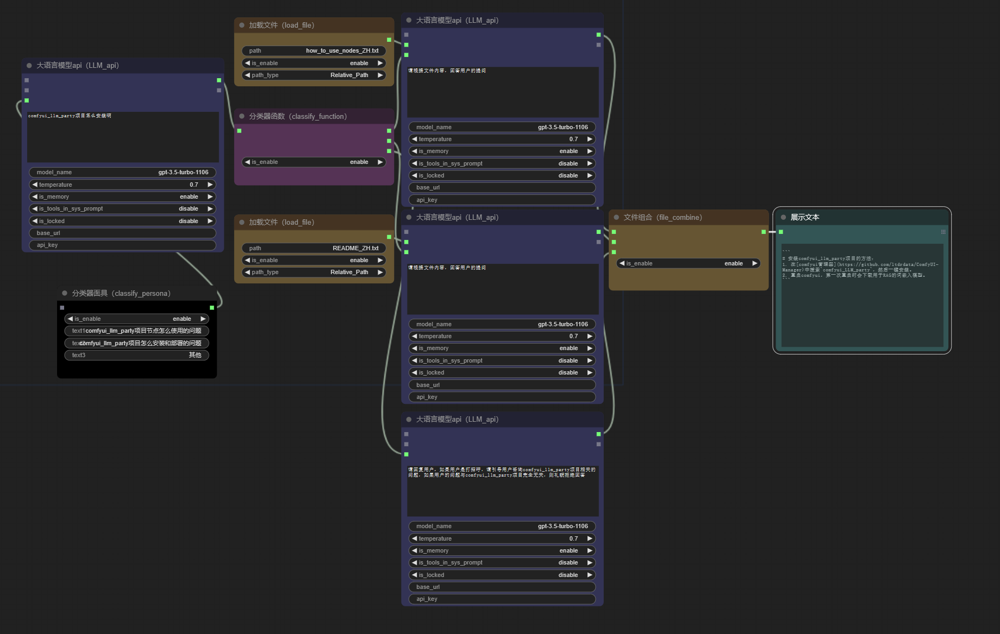

   <strong>中文</strong> | <a href="./README.md">English</a>

## 最新更新
1. 目前已经支持了macOS以及mps设备!感谢[bigcat88](https://github.com/bigcat88)对此的贡献！
2. 支持了GPT-4O的视觉功能！
3. 新增了一个工作流中转器，可以让你的工作流调用其他的工作流!
4. 新增了万能解释器节点，可以让大模型执行任何事情，大模型将会在一个虚拟环境里下载所需的第三方库，然后执行生成的代码，请小心使用这个工具，因为大模型会获得控制你电脑做任何事的能力！
5. 给大家带来了一个很酷的套娃功能，你需要将LLM节点的main_brain属性disable，就可以把这个LLM节点当作tool使用，将这个节点的tool链接到另一个正常的LLM上，就会发现，另一个LLM可以像工具一样调用它！
6. 新增了start_workflow和end_workflow节点，你可以用这个两个节点来定义工作流的起点和终点，将你的工作流放到本项目文件夹下的workflow子文件夹，然后在本项目文件夹下点击setup_streamlit_app.bat，在streamlit的界面中，点击设置，替换为你的工作流。

# **COMFYUI LLM PARTY——面向comfyui开发的LLM工具节点库**

## 简介
[comfyui](https://github.com/comfyanonymous/ComfyUI)是一个极为简约的UI界面，主要用于AI绘图等基于SD模型的工作流搭建。本项目希望基于comfyui开发一套完整的用于LLM工作流搭建的节点库。可以让用户更便捷快速地搭建自己的LLM工作流，并且更方便地接入自己的SD工作流中。（图为一个智能客服的工作流，更多的工作流可以参考[workflow](workflow)文件夹）

## 使用说明
1. [【ComfyUI×LLM】手把手教你如何搭建积木化智能体（超简单！）](https://www.bilibili.com/video/BV1JZ421v7Tw/?vd_source=f229e378448918b84afab7c430c6a75b)

2. [[ComfyUI黑科技]教你GPT-4o接入comfyui | 让工作流调用另一个工作流 | 让LLM变成一个tool](https://www.bilibili.com/video/BV1JJ4m1A789/?spm_id_from=333.999.0.0&vd_source=f229e378448918b84afab7c430c6a75b)

## 功能
1. 你可以在comfyui界面里点击右键，选择右键菜单里的`llm`，即可找到本项目的节点。[怎么使用节点](how_to_use_nodes_ZH.md)
2. 支持API接入或者本地大模型接入。模块化实现工具调用功能。在填入base_url时，请填入以`/v1/`结尾的网址。你可以用[ollama](https://github.com/ollama/ollama)来管理你的模型，然后在base_url填入`http://localhost:11434/v1/`，在api_key填入ollama，在model_name填入你的模型名称，例如:llama3，如果调用失败503，可以尝试关闭代理服务器。
3. 本地知识库接入，支持RAG
4. 可以调用代码解释器
5. 可以联网查询，支持谷歌搜索
6. 可以在comfyui中实现条件语句，可以对用户提问进行分类后再针对性回复
7. 支持大模型的回环链接，可以让两个大模型打辩论赛
8. 支持挂接任意人格面具，可以自定义提示词模板
9. 支持多种工具调用，目前开发了查天气、查时间、知识库、代码执行、联网搜索、对单一网页进行搜索等功能。
10. 支持将LLM当作一个工具节点使用
11. 支持通过API+streamlit快速开发自己的web应用，下图为一个绘画应用示例。
12. 新增了危险的万能解释器节点，可以让大模型做任何事情
13. 推荐使用右键菜单里的函数（function）子目录下的显示文本（show_text）节点，作为LLM节点的输出显示

## 下载
使用以下方法之一安装
### 方法一：
1. 在[comfyui管理器](https://github.com/ltdrdata/ComfyUI-Manager)中搜索`comfyui_LLM_party`，一键安装
2. 重启comfyui

### 方法二：
1. 导航到 ComfyUI 根文件夹中下的`custom_nodes`子文件夹
2. 使用克隆此存储库。`git clone https://github.com/heshengtao/comfyui_LLM_party.git`

### 方法三：
1. 点击右上角的`CODE`
2. 点击`download zip`
3. 将下载的压缩包解压到ComfyUI 根文件夹中下的`custom_nodes`子文件夹中

## 环境部署
1. 导航到`comfyui_LLM_party`的项目文件夹
2. 在终端输入`pip install -r requirements.txt`将本项目需要的第三方库部署到comfyui的环境中。请注意你是否在comfyui的环境进行安装，并关注终端中的`pip`报错
3. 如果你是用的comfyui启动器，你需要在终端中输入 `启动器配置中的路径\python_embeded\python.exe 启动器配置中的路径\python_embeded\Scripts\pip.exe  install -r requirements.txt`进行安装。`python_embeded`文件夹一般与你的`ComfyUI`文件夹同级。

## 配置
可以使用以下方法之一配置APIKEY
### 方法一：
1. 打开`comfyui_LLM_party`的项目文件夹下的`config.ini`文件
2. 在`config.ini`输入你的`openai_api_key`、`base_url`
3. 如果你要使用谷歌搜索工具，在`config.ini`输入你的`google_api_key`、`cse_id`

### 方法二：
1. 打开comfyui界面
2. 新建大语言模型（LLM）节点，在节点中直接输入你的`openai_api_key`、`base_url`
3. 新建谷歌搜索工具（google_tool）节点，在节点中直接输入你的`google_api_key`、`cse_id`

## 下一步计划：
1. 更多的模型适配，至少可以覆盖主流的大模型API接口和主流的开源模型的本地调用，以及更多的LVM模型的适配，目前我还只适配了GPT4的视觉功能的调用；
2. 更多的智能体的搭建方式，目前我在这方面已完成的工作有，将LLM作为一个工具导入给另一个LLM，实现辐射状构建LLM工作流，将一个工作流作为一个节点导入另一个工作流，我未来可能会在这个方面做出一些更酷的功能。
3. 更多的自动化功能，我未来会推出更多将图片、文字、视频、音频自动推送到其他应用上的节点，也会推出监听节点，实现自动回复主流社交软件和论坛的功能。
4. 更多的知识库管理功能，目前本项目已经支持了本地文件搜索、网络搜索，未来我会推出知识图谱搜索、长期记忆搜索。让智能体可以带有逻辑的思考专业知识、与用户对话时可以永远记住某些关键信息的功能。
5. 更多的工具、更多的人格面具，这块最容易做，但也是最需要积累的，希望未来我可以让这个项目也可以像comfyui拥有众多自定义节点一样，拥有众多的工具和人格面具。

## 免责声明：
本开源项目及其内容（以下简称“项目”）仅供参考之用，并不意味着任何明示或暗示的保证。项目贡献者不对项目的完整性、准确性、可靠性或适用性承担任何责任。任何依赖项目内容的行为均需自行承担风险。在任何情况下，项目贡献者均不对因使用项目内容而产生的任何间接、特殊或附带的损失或损害承担责任。

## 如果我的工作给您带来了价值，请考虑请我喝一杯咖啡吧！您的支持不仅为项目注入活力，也温暖了创作者的心。☕💖 每一杯都有意义！

    
    

