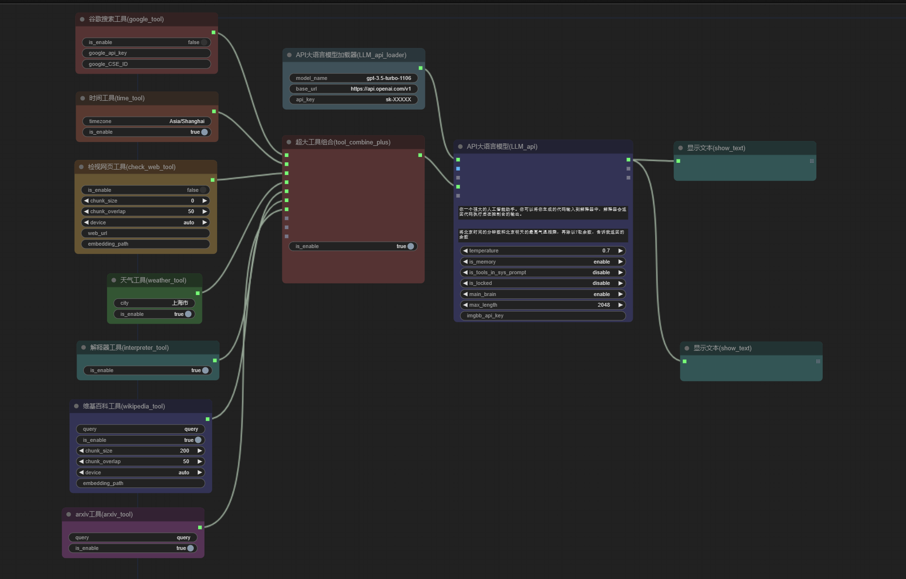
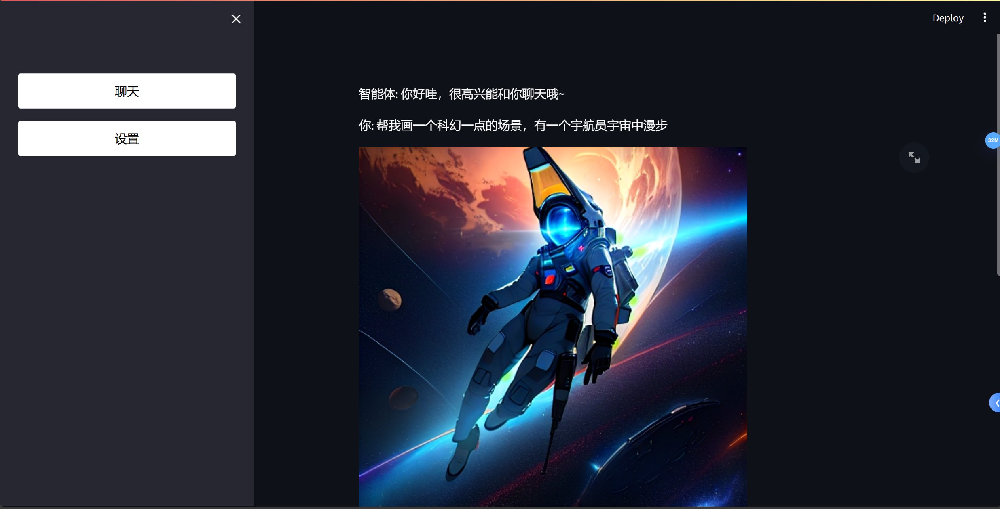

   <strong>中文</strong> | <a href="./README.md">English</a>

## 最新更新
1. 在本地LLM加载器、本地llava加载器、本地guff加载器上添加了model name属性，如果为空，则使用节点中的各类本地path加载。如果不为空，则会使用`config.ini`中你自己填写的路径参数加载。如果不为空且不在`config.ini`中，则会从huggingface上下载或则从huggingface的模型方法目录中加载。如果你想从huggingface上下载，请按照例如：`THUDM/glm-4-9b-chat`的格式填写model name属性。注意！这样子加载的模型必须适配transformer库。
2. 适配了[CosyVoice](https://github.com/FunAudioLLM/CosyVoice)，现在可以无需下载任何模型或者任何API key，直接使用TTS功能。目前该接口只适配了中文。
3. 新增了JSON文件解析节点和JSON取值节点，可以让你从文件或者文本中获取某一个键的值。感谢[guobalove](https://github.com/guobalove)的贡献！
4. 改进了工具调用的代码，现在没有工具调用功能的LLM也可以开启is_tools_in_sys_prompt属性（本地LLM默认无需开启，自动适配），开启之后，工具信息会添加到系统提示词中，这样LLM就可以调用工具了。
5. 新建了custom_tool文件夹，用于存放自定义工具的代码，可以参考[custom_tool](custom_tool)文件夹中的代码，将自定义工具的代码放入custom_tool文件夹中，即可在LLM中调用自定义工具。
6. 新增了知识图谱工具，让LLM与知识图谱可以完美交互，LLM可以根据你的输入修改知识图谱，可以在知识图谱上推理以获取你需要的答案。示例工作流参考：[graphRAG_neo4j](workflow/graphRAG_neo4j.json)
7. 新增了人格AI功能，0代码开发自己的女友AI或男友AI，无限对话，永久记忆，人设稳定。示例工作流参考：[麦洛薇人格AI](workflow/麦洛薇人格AI.json)

# **COMFYUI LLM PARTY——面向comfyui开发的LLM工具节点库**

## 简介
[comfyui](https://github.com/comfyanonymous/ComfyUI)是一个极为简约的UI界面，主要用于AI绘图等基于SD模型的工作流搭建。本项目希望基于comfyui开发一套完整的用于LLM工作流搭建的节点库。可以让用户更便捷快速地搭建自己的LLM工作流，并且更方便地接入自己的SD工作流中。（图为一个LLM实现多工具调用的工作流，更多的工作流可以参考[workflow](workflow)文件夹）

## 使用说明
1. [手把手教你如何搭建积木化智能体（超简单！）](https://www.bilibili.com/video/BV1JZ421v7Tw/?vd_source=f229e378448918b84afab7c430c6a75b)

2. [教你GPT-4o接入comfyui | 让工作流调用另一个工作流 | 让LLM变成一个tool](https://www.bilibili.com/video/BV1JJ4m1A789/?spm_id_from=333.999.0.0&vd_source=f229e378448918b84afab7c430c6a75b)

3. [将你的工作流伪装成GPT接入微信|Omost兼容！灵活地创造自己的dalle3](https://www.bilibili.com/video/BV1DT421a7KY/?spm_id_from=333.999.0.0)

4. [如何在comfyui中玩到互动小说游戏](https://www.bilibili.com/video/BV15y411q78L/?spm_id_from=333.999.0.0&vd_source=f229e378448918b84afab7c430c6a75b)

5. 节点的使用说明请参考：[怎么使用节点](how_to_use_nodes_ZH.md)

6. 如果插件存在问题或者您有其他的疑问，欢迎加入QQ群：[931057213](img/Q群.jpg)

## 模型支持
1. 支持所有openai格式的API调用，base_url的选择参考[config.ini.example](config.ini.example)，目前已测试的有：
* [ollama](https://github.com/ollama/ollama)
* [通义千问/qwen](https://help.aliyun.com/zh/dashscope/developer-reference/compatibility-of-openai-with-dashscope/?spm=a2c4g.11186623.0.0.7b576019xkArPq)
* [智谱清言/glm](https://open.bigmodel.cn/dev/api#http_auth)
* [deepseek](https://platform.deepseek.com/api-docs/zh-cn/)
* [kimi/moonshot](https://platform.moonshot.cn/docs/api/chat#%E5%9F%BA%E6%9C%AC%E4%BF%A1%E6%81%AF)

2. 兼容transformer库支持的大部分本地模型，目前已测试的有：
* [THUDM/chatglm3-6b](https://huggingface.co/THUDM/chatglm3-6b)
* [meta-llama/Llama-2-7b-chat-hf](https://huggingface.co/meta-llama/Llama-2-7b-chat-hf)
* [Qwen/Qwen2-7B-Instruct](https://huggingface.co/Qwen/Qwen2-7B-Instruct)
* [xtuner/llava-llama-3-8b-v1_1-gguf](https://huggingface.co/xtuner/llava-llama-3-8b-v1_1-gguf)
* [omost-llama-3-8b-4bits](https://huggingface.co/lllyasviel/omost-llama-3-8b-4bits)

## 功能
1. 你可以在comfyui界面里点击右键，选择右键菜单里的`llm`，即可找到本项目的节点。[怎么使用节点](how_to_use_nodes_ZH.md)
2. 支持API接入或者本地大模型接入。模块化实现工具调用功能。在填入base_url时，请填入以`/v1/`结尾的网址。你可以用[ollama](https://github.com/ollama/ollama)来管理你的模型，然后在base_url填入`http://127.0.0.1:11434/v1/`，在api_key填入ollama，在model_name填入你的模型名称，例如:llama3。
- API接入示例工作流：[start_with_LLM_api](workflow/start_with_LLM_api.json)
- 本地模型接入示例工作流：[start_with_LLM_local](workflow/start_with_LLM_local.json)
- ollama接入示例工作流：[ollama](workflow/ollama.json)
3. 本地知识库接入，支持RAG。示例工作流：[知识库RAG搜索.json](workflow/知识库RAG搜索.json)
4. 可以调用代码解释器
5. 可以联网查询，支持谷歌搜索。示例工作流：[电影查询工作流](workflow/电影查询工作流.json)
6. 可以在comfyui中实现条件语句，可以对用户提问进行分类后再针对性回复。示例工作流：[智能客服](workflow/智能客服.json)
7. 支持大模型的回环链接，可以让两个大模型打辩论赛。示例工作流：[电车难题辩论赛](workflow/电车难题辩论赛.json)
8. 支持挂接任意人格面具，可以自定义提示词模板
9. 支持多种工具调用，目前开发了查天气、查时间、知识库、代码执行、联网搜索、对单一网页进行搜索等功能。
10. 支持将LLM当作一个工具节点使用。示例工作流：[LLM套娃](workflow/LLM套娃.json)
11. 支持通过API+streamlit快速开发自己的web应用，下图为一个绘画应用示例。
12. 新增了危险的万能解释器节点，可以让大模型做任何事情
13. 推荐使用右键菜单里的函数（function）子目录下的显示文本（show_text）节点，作为LLM节点的输出显示
14. 支持了GPT-4O的视觉功能！示例工作流：[GPT-4o](workflow/GPT-4o.json)
15. 新增了一个工作流中转器，可以让你的工作流调用其他的工作流!示例工作流：[调用另一个工作流](workflow/调用另一个工作流.json)
16. 适配了所有具有类似openai接口的模型，例如：通义千问/qwen、智谱清言/GLM、deepseek、kimi/moonshot。请将这些模型的base_url、api_key、model_name填入LLM节点以调用它们。
17. 新增了一个LVM加载器，现在可以本地调用LVM模型了，支持[llava-llama-3-8b-v1_1-gguf](https://huggingface.co/xtuner/llava-llama-3-8b-v1_1-gguf)模型，其他LVM模型如果是GUFF格式，理论上应该也可以运行。示例工作流在这里: [start_with_LVM.json](workflow/start_with_LVM.json).
18. 写了一个`fastapi.py`文件，如果你直接运行它，你就获得了一个`http://127.0.0.1:8817/v1/`上的openai接口，任何可以调用GPT的应用都可以调用你的comfyui工作流了！详细怎么操作我会出一期教程来演示~
19. 拆分了LLM加载器和LLM链，把模型加载和模型设置分开来了，这样就可以在不同的LLM节点之间共享模型了!
20. 目前已经支持了macOS以及mps设备!感谢[bigcat88](https://github.com/bigcat88)对此的贡献！
21. 可以搭建自己的互动小说游戏了，根据用户的选择，走向不同的结局！示例工作流参考：[互动小说](workflow/互动小说.json)
22. 适配了openai的whisper和tts功能，可以实现语音输入和输出。示例工作流参考：[语音输入+语音输出](workflow/语音输入+语音输出.json)
23. 兼容[Omost](https://github.com/lllyasviel/Omost)啦！！！请下载[omost-llama-3-8b-4bits](https://huggingface.co/lllyasviel/omost-llama-3-8b-4bits)立即体验吧！示例工作流参考：[start_with_OMOST](workflow/start_with_OMOST.json)
24. 新增了将消息发送到企业微信、钉钉和飞书的LLM工具以及可供调用的外部函数。

## 下载
使用以下方法之一安装
### 方法一：
1. 在[comfyui管理器](https://github.com/ltdrdata/ComfyUI-Manager)中搜索`comfyui_LLM_party`，一键安装
2. 重启comfyui

### 方法二：
1. 导航到 ComfyUI 根文件夹中下的`custom_nodes`子文件夹
2. 使用克隆此存储库。`git clone https://github.com/heshengtao/comfyui_LLM_party.git`

### 方法三：
1. 点击右上角的`CODE`
2. 点击`download zip`
3. 将下载的压缩包解压到ComfyUI 根文件夹中下的`custom_nodes`子文件夹中

## 环境部署
1. 导航到`comfyui_LLM_party`的项目文件夹
2. 在终端输入`pip install -r requirements.txt`将本项目需要的第三方库部署到comfyui的环境中。请注意你是否在comfyui的环境进行安装，并关注终端中的`pip`报错
3. 如果你是用的comfyui启动器，你需要在终端中输入 `启动器配置中的路径\python_embeded\python.exe -m pip install -r requirements.txt`进行安装。`python_embeded`文件夹一般与你的`ComfyUI`文件夹同级。
4. 如果你出现了一些环境配置问题，可以尝试使用`requirements_fixed.txt`中的依赖。

## 配置
可以使用以下方法之一配置APIKEY
### 方法一：
1. 打开`comfyui_LLM_party`的项目文件夹下的`config.ini`文件
2. 在`config.ini`输入你的`openai_api_key`、`base_url`
3. 如果你要使用谷歌搜索工具，在`config.ini`输入你的`google_api_key`、`cse_id`

### 方法二：
1. 打开comfyui界面
2. 新建大语言模型（LLM）节点，在节点中直接输入你的`openai_api_key`、`base_url`
3. 新建谷歌搜索工具（google_tool）节点，在节点中直接输入你的`google_api_key`、`cse_id`

## 下一步计划：
1. 更多的模型适配，至少可以覆盖主流的大模型API接口和主流的开源模型的本地调用，以及更多的LVM模型的适配，目前我还只适配了GPT4的视觉功能的调用；
2. 更多的智能体的搭建方式，目前我在这方面已完成的工作有，将LLM作为一个工具导入给另一个LLM，实现辐射状构建LLM工作流，将一个工作流作为一个节点导入另一个工作流，我未来可能会在这个方面做出一些更酷的功能。
3. 更多的自动化功能，我未来会推出更多将图片、文字、视频、音频自动推送到其他应用上的节点，也会推出监听节点，实现自动回复主流社交软件和论坛的功能。
4. 更多的知识库管理功能，目前本项目已经支持了本地文件搜索、网络搜索，未来我会推出知识图谱搜索、长期记忆搜索。让智能体可以带有逻辑的思考专业知识、与用户对话时可以永远记住某些关键信息的功能。
5. 更多的工具、更多的人格面具，这块最容易做，但也是最需要积累的，希望未来我可以让这个项目也可以像comfyui拥有众多自定义节点一样，拥有众多的工具和人格面具。

## 免责声明：
本开源项目及其内容（以下简称“项目”）仅供参考之用，并不意味着任何明示或暗示的保证。项目贡献者不对项目的完整性、准确性、可靠性或适用性承担任何责任。任何依赖项目内容的行为均需自行承担风险。在任何情况下，项目贡献者均不对因使用项目内容而产生的任何间接、特殊或附带的损失或损害承担责任。

## 特别感谢

## 支持：

### 如果我的工作给您带来了价值，请考虑请我喝一杯咖啡吧！您的支持不仅为项目注入活力，也温暖了创作者的心。☕💖 每一杯都有意义！

    
    

### 如果插件存在问题或者您有其他的疑问，欢迎加入QQ群：931057213

    

### 如果想持续关注本项目的最新功能，欢迎关注B站账号：[哔哩哔哩人工智能机器人](https://space.bilibili.com/26978344)
