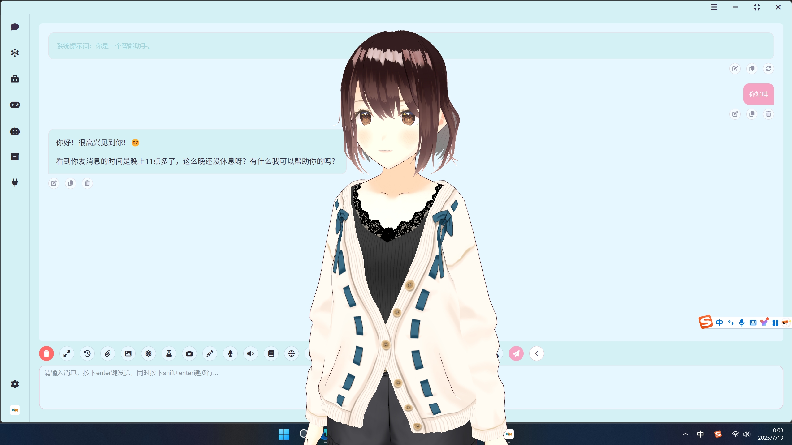

<div align="center">
  <a href="https://space.bilibili.com/26978344">B站</a> ·
  <a href="https://www.youtube.com/@LLM-party">youtube</a> ·
  <a href="https://github.com/heshengtao/Let-LLM-party">文字教程</a> ·
  <a href="https://pan.quark.cn/s/190b41f3bbdb">网盘链接</a> ·
  <a href="img/Q群.jpg">QQ群</a> ·
  <a href="https://discord.gg/f2dsAKKr2V">discord</a> ·
  <a href="https://dcnsxxvm4zeq.feishu.cn/wiki/IyUowXNj9iH0vzk68cpcLnZXnYf">关于我们</a>
</div>

####

<div align="center">
  <a href="./README_ZH.md"></a>
  <a href="./README.md"></a>
  <a href="./README_RU.md"></a>
  <a href="./README_FR.md"></a> 
  <a href="./README_DE.md"></a>
  <a href="./README_JA.md"></a>
  <a href="./README_KO.md"></a>
  <a href="./README_AR.md"></a>
  <a href="./README_ES.md"></a>
  <a href="./README_PT.md"></a>
</div>

####

C​‎​‎‏​‍‎​‎​‎‏​‌‎​‎‍​‍‏​‍‌​‌‏omfyui_llm_party希望基于[comfyui](https://github.com/comfyanonymous/ComfyUI)这一个极为简约的UI界面作为前端，开发一套完整的用于LLM工作流搭建的节点库。可以让用户更便捷快速地搭建自己的LLM工作流，并且更方便地接入自己的图像工作流中。

## 效果展示
https://github.com/user-attachments/assets/9e627204-4626-479e-8806-cb06cd6157a6

## 项目综述

ComfyUI LLM Party，从最基础的 LLM 多工具调用、角色设定快速搭建自己的专属AI助手、到可以行业落地的词向量RAG、GraphRAG来本地化的管理行业内知识库；从单一的智能体流水线，到复杂的智能体与智能体辐射状交互模式、环形交互模式的构建;从个人用户需要的接入自己的社交APP(QQ、飞书、Discord)，到流媒体工作者需要的一站式LLM+TTS+ComfyUI工作流；从普通学生所需要的第一个LLM应用的简单上手起步，到科研工作者们常用的各类参数调试接口，模型适配。这一切，你都可以在ComfyUI LLM Party中找到答案。

## 快速开始
0. 如果你从来没有使用过comfyui，且在comfyui中安装LLM party时出现了一些依赖问题。点击[这里](https://drive.google.com/file/d/1T9C7gEbd-w_zf9GqZO1VeI3z8ek8clpX/view?usp=sharing)，下载包含LLM party的comfyui **windows**便携包。注意！这个便携包里只有party和管理器这两个插件，且只适用于windows系统。（如果你需要将LLM party安装到已有的comfyui，该步骤可以跳过。）
1. 直接将以下工作流拖入你的comfyui，然后用[comfyui-Manager](https://github.com/ltdrdata/ComfyUI-Manager)安装缺失节点。
  - 使用API调用LLM：[start_with_LLM_api](workflow/start_with_LLM_api.json)
  - 使用aisuite调用LLM：[start_with_aisuite](workflow/start_with_aisuite.json)
  - 使用ollama管理本地LLM：[start_with_Ollama](workflow/ollama.json)
  - 使用分散格式的本地LLM：[start_with_LLM_local](workflow/start_with_LLM_local.json)
  - 使用GGUF格式的本地LLM：[start_with_LLM_GGUF](workflow/start_with_GGUF.json)
  - 使用分散格式的本地VLM：[start_with_VLM_local](workflow/start_with_VLM_local.json)（目前已经支持[Llama-3.2-Vision](https://huggingface.co/meta-llama/Llama-3.2-11B-Vision-Instruct)/[Qwen/Qwen2.5-VL](https://huggingface.co/Qwen/Qwen2.5-VL-3B-Instruct)/[deepseek-ai/Janus-Pro](https://huggingface.co/deepseek-ai/Janus-Pro-1B)）
  - 使用GGUF格式的本地VLM：[start_with_VLM_GGUF](workflow/start_with_llava.json)
  - 使用API调用LLM生成SD提示词并生成图片：[start_with_VLM_API_for_SD](workflow/start_with_VLM_API_for_SD.json)
  - 使用ollama调用minicpm生成SD提示词并生成图片：[start_with_ollama_minicpm_for_SD](workflow/start_with_ollama_minicpm_for_SD.json)
  - 使用本地的qwen-vl生成SD提示词并生成图片：[start_with_qwen_vl_local_for_SD](workflow/start_with_qwen_vl_local_for_SD.json)
2. 如果你是使用API，在API LLM加载器节点上填入你的`base_url`（可以是中转API，注意结尾要用`/v1/`），例如：`https://api.openai.com/v1/` 以及`api_key`。
3. 如果你是使用ollama，在API LLM加载器节点上打开`is_ollama`选项，无需填写`base_url`和`api_key`。
4. 如果你是使用本地模型，在本地模型加载器节点上填入你的模型路径，例如：`E:\model\Llama-3.2-1B-Instruct`。也可以在本地模型加载器节点上填入hunggingface的模型repo id，例如：`lllyasviel/omost-llama-3-8b-4bits`。
5. 由于本项目有较高的使用门槛，所以即使你选择了快速开始，我也希望你能耐心阅读完本项目主页。

## 最新更新
1. LLM API节点已支持流式输出模式，会在控制台流式显示输出API返回的文本，这样你就可以实时看到API的输出，而不用等待整个请求完成。
2. LLM API节点添加了reasoning_content输出，可以自动分离出R1模型的reasoning和response。
3. 新增了only_api的仓库分支，该分支只包含调用API的部分，方便只需要API调用的用户，只需要在`comfyui`的`custom tool`文件夹中使用命令行`git clone -b only_api https://github.com/heshengtao/comfyui_LLM_party.git`，然后按照本项目主页的环境部署方案，即可使用这个分支。注意！如果你需要保证`custom tool`文件夹中没有其他叫`comfyui_LLM_party`的文件夹。
1. VLM本地加载器节点已经支持[deepseek-ai/Janus-Pro](https://huggingface.co/deepseek-ai/Janus-Pro-1B)，示例工作流：[Janus-Pro](workflow/deepseek-janus-pro.json) 
1. VLM本地加载器节点已经支持[Qwen/Qwen2.5-VL-3B-Instruct](https://huggingface.co/Qwen/Qwen2.5-VL-3B-Instruct)，但是你需要将transformer更新到最新版本（```pip install -U transformers```），示例工作流：[qwen-vl](workflow/qwen-vl.json)
1. 添加了一个全新的图床节点，目前支持了 https://sm.ms 图床(中国地区域名为 https://smms.app)以及 https://imgbb.com 图床，未来会支持更多的图床，示例工作流：[图床](workflow/图床.json) 
1. ~~party默认兼容的imgbb图床已更新到[imgbb](https://imgbb.io)这一域名上，之前的图床由于对于中国大陆用户不友好，所以已经更换。~~ 非常不好意思，https://imgbb.io 的图床API服务似乎已经停止了，所以代码回滚到了原先的  https://imgbb.com ，感谢大家的理解。未来我会更新一个支持更多图床的节点。
1. 更新了[MCP](https://modelcontextprotocol.io/introduction)工具，你可以修改party项目文件夹下的'[mcp_config.json](mcp_config.json)'中的配置来调整你要连接上的MCP服务器。你可以在这里找到你想要添加的各种MCP服务器配置参数：[modelcontextprotocol/servers](https://github.com/modelcontextprotocol/servers)。本项目中默认配置为Everything服务器，一个用于测试MCP服务器是否可以正常使用的服务器。参考工作流：[start_with_MCP](workflow/start_with_MCP.json)。开发者注：MCP工具节点可以连接上你配置好的MCP服务器，然后将服务器中的tools转换成LLM可以直接使用的工具。通过配置不同的本地服务器或者云服务器，你可以体验到这个世界上所有LLM工具。

## 使用说明
1. 节点的使用说明请参考：[怎么使用节点](https://github.com/heshengtao/Let-LLM-party)

2. 如果插件存在问题或者您有其他的疑问，欢迎加入QQ群：[931057213](img/Q群.jpg) | discord：[discord](https://discord.gg/f2dsAKKr2V)

3. 更多的工作流可以参考[workflow](workflow)文件夹

## 视频教程
<a href="https://space.bilibili.com/26978344">
  
</a>
<a href="https://www.youtube.com/@LLM-party">
  
</a>

## 模型支持
1. 支持所有openai格式的API调用(结合[oneapi](https://github.com/songquanpeng/one-api)可以调用几乎所有LLM API，也支持所有的中转API)，base_url的选择参考[config.ini.example](config.ini.example)，目前已测试的有：
* [openai](https://platform.openai.com/docs/api-reference/chat/create)（完美适配所有的openai模型，包括4o和o1系列！）
* [ollama](https://github.com/ollama/ollama)（推荐！如果你是本地调用，非常推荐使用ollama方式托管你的本地模型！）
* [Azure OpenAI](https://azure.microsoft.com/zh-cn/products/ai-services/openai-service/)
* [llama.cpp](https://github.com/ggerganov/llama.cpp?tab=readme-ov-file#web-server)（推荐！如果你想使用本地gguf格式的模型，可以使用llama.cpp项目的API接入本项目！）
* [Grok](https://x.ai/api)
* [通义千问/qwen](https://help.aliyun.com/zh/dashscope/developer-reference/compatibility-of-openai-with-dashscope/?spm=a2c4g.11186623.0.0.7b576019xkArPq)
* [智谱清言/glm](https://open.bigmodel.cn/dev/api#http_auth)
* [deepseek](https://platform.deepseek.com/api-docs/zh-cn/)
* [kimi/moonshot](https://platform.moonshot.cn/docs/api/chat#%E5%9F%BA%E6%9C%AC%E4%BF%A1%E6%81%AF)
* [豆包](https://www.volcengine.com/docs/82379/1263482)
* [讯飞星火/spark](https://xinghuo.xfyun.cn/sparkapi?scr=price)
* [Gemini](https://developers.googleblog.com/zh-hans/gemini-is-now-accessible-from-the-openai-library/)(原本的Gemini API LLM 加载器节点在新版本的已被弃用，请使用LLM API加载器节点，base_url选择为：https://generativelanguage.googleapis.com/v1beta/openai/)

2. 支持[aisuite](https://github.com/andrewyng/aisuite)兼容的所有API调用：
* [anthropic/claude](https://www.anthropic.com/)
* [aws](https://docs.aws.amazon.com/solutions/latest/generative-ai-application-builder-on-aws/api-reference.html)
* [vertex](https://cloud.google.com/vertex-ai/docs/reference/rest)
* [huggingface](https://huggingface.co/)

3. 兼容transformer库的大部分本地模型（本地LLM模型链节点上的model type已改成LLM、VLM-GGUF、LLM-GGUF三个选项，对应了直接加载LLM模型、加载VLM模型和加载GGUF格式的LLM模型），如果你的VLM或GGUF格式的LLM模型报错了，请在[llama-cpp-python](https://github.com/abetlen/llama-cpp-python/releases)下载最新版本的llama-cpp-python，目前已测试的有：
* [ClosedCharacter/Peach-9B-8k-Roleplay](https://huggingface.co/ClosedCharacter/Peach-9B-8k-Roleplay)(推荐！角色扮演模型)
* [lllyasviel/omost-llama-3-8b-4bits](https://huggingface.co/lllyasviel/omost-llama-3-8b-4bits)(推荐！丰富提示词模型)
* [meta-llama/Llama-2-7b-chat-hf](https://huggingface.co/meta-llama/Llama-2-7b-chat-hf)
* [Qwen/Qwen2-7B-Instruct](https://huggingface.co/Qwen/Qwen2-7B-Instruct)
* [openbmb/MiniCPM-V-2_6-gguf](https://huggingface.co/openbmb/MiniCPM-V-2_6-gguf/tree/main)
* [lmstudio-community/Meta-Llama-3.1-8B-Instruct-GGUF](https://huggingface.co/lmstudio-community/Meta-Llama-3.1-8B-Instruct-GGUF/tree/main)
* [meta-llama/Llama-3.2-11B-Vision-Instruct](https://huggingface.co/meta-llama/Llama-3.2-11B-Vision-Instruct)
* [Qwen/Qwen2.5-VL-3B-Instruct](https://huggingface.co/Qwen/Qwen2.5-VL-3B-Instruct)
* [deepseek-ai/Janus-Pro](https://huggingface.co/deepseek-ai/Janus-Pro-1B)

4. 模型下载：
* [夸克云地址](https://pan.quark.cn/s/190b41f3bbdb)
* [百度云地址](https://pan.baidu.com/share/init?surl=T4aEB4HumdJ7iVbvsv1vzA&pwd=qyhu)，提取码：qyhu

## 下载
使用以下方法之一安装
### 方法一：
1. 在[comfyui管理器](https://github.com/ltdrdata/ComfyUI-Manager)中搜索`comfyui_LLM_party`，一键安装
2. 重启comfyui

### 方法二：
1. 导航到 ComfyUI 根文件夹中下的`custom_nodes`子文件夹
2. 使用克隆此存储库。`git clone https://github.com/heshengtao/comfyui_LLM_party.git`

### 方法三：
1. 点击右上角的`CODE`
2. 点击`download zip`
3. 将下载的压缩包解压到ComfyUI 根文件夹中下的`custom_nodes`子文件夹中

## 环境部署
1. 导航到`comfyui_LLM_party`的项目文件夹
2. 在终端输入`pip install -r requirements.txt`将本项目需要的第三方库部署到comfyui的环境中。请注意你是否在comfyui的环境进行安装，并关注终端中的`pip`报错
3. 如果你是用的comfyui启动器，你需要在终端中输入 `启动器配置中的路径\python_embeded\python.exe -m pip install -r requirements.txt`进行安装。`python_embeded`文件夹一般与你的`ComfyUI`文件夹同级。
4. 如果你出现了一些环境配置问题，可以尝试使用`requirements_fixed.txt`中的依赖。

## 配置
* 可以在`config.ini`中配置语言，目前只有中文（zh_CN）和英文（en_US）两种，默认为你的系统语言。
* 可以在`config.ini`中配置是否快速安装，`fast_installed`默认为`False`，如果不需要使用GGUF模型，可以设置为`True`。
* 可以使用以下方法之一配置APIKEY
### 方法一：
1. 打开`comfyui_LLM_party`的项目文件夹下的`config.ini`文件。
2. 在`config.ini`输入你的`openai_api_key`、`base_url`。
3. 如果你使用ollama模型，在`base_url`填入`http://127.0.0.1:11434/v1/`，在`openai_api_key`填入`ollama`，在`model_name`填入你的模型名称，例如:llama3。
4. 如果你要使用谷歌搜索或者必应搜索工具，在`config.ini`输入你的`google_api_key`、`cse_id`或`bing_api_key`。
5. 如果你要使用图片输入LLM，推荐使用图床imgbb，在`config.ini`输入你的`imgbb_api`。
6. 每个模型都可以在`config.ini`文件中单独配置，可以参考`config.ini.example`文件填写。当你配置好之后，只需要在节点上输入`model_name`即可。

### 方法二：
1. 打开comfyui界面。
2. 新建大语言模型（LLM）节点，在节点中直接输入你的`openai_api_key`、`base_url`。
3. 如果你使用ollama模型，请使用LLM_api节点，在节点的`base_url`填入`http://127.0.0.1:11434/v1/`，在`api_key`填入`ollama`，在`model_name`填入你的模型名称，例如:llama3。。
4. 如果你要使用图片输入LLM，推荐使用图床imgbb，在节点上输入你的`imgbb_api_key`。

## 更新日志
**[Click here](change_log.md)**

## 下一步计划：
1. 更多的模型适配；
2. 更多的智能体的搭建方式。
3. 更多的自动化功能。
4. 更多的知识库管理功能。
5. 更多的工具、更多的人格面具。

## 我的另一个好用的开源项目：
[super-agent-party](https://github.com/heshengtao/super-agent-party)是一个拥有无限可能的3D AI桌面伴侣应用！已支持RAG、网络搜索、长期记忆、代码解释器、MCP、A2A、Comfyui、QQ 机器人以及更多功能！



## 免责声明：
本开源项目及其内容（以下简称“项目”）仅供参考之用，并不意味着任何明示或暗示的保证。项目贡献者不对项目的完整性、准确性、可靠性或适用性承担任何责任。任何依赖项目内容的行为均需自行承担风险。在任何情况下，项目贡献者均不对因使用项目内容而产生的任何间接、特殊或附带的损失或损害承担责任。

## 特别感谢
<a href="https://github.com/bigcat88">
  
</a>
<a href="https://github.com/guobalove">
  
</a>
<a href="https://github.com/SpenserCai">
  
</a>

## 借物表
本项目中的一些节点借鉴了以下项目，感谢他们在开源社区中的贡献！
1. [pythongosssss/ComfyUI-Custom-Scripts](https://github.com/pythongosssss/ComfyUI-Custom-Scripts)
2. [lllyasviel/Omost](https://github.com/lllyasviel/Omost)

## 支持：

### 加入社群
如果插件存在问题或者您有其他的疑问，欢迎加入我们的社群。

1. QQ群：`931057213`

<div style="display: flex; justify-content: center;">
    
</div>

2. 微信群：`we_glm`（添加小助手微信后进群）

3. discord:[discord链接](https://discord.gg/f2dsAKKr2V)

### 关注我们
1. 如果想持续关注本项目的最新功能，欢迎关注B站账号：[派酱](https://space.bilibili.com/26978344)
2. [youtube@LLM-party](https://www.youtube.com/@LLM-party)

### 捐赠支持
如果我的工作给您带来了价值，请考虑请我喝一杯咖啡吧！您的支持不仅为项目注入活力，也温暖了创作者的心。☕💖 每一杯都有意义！
<div style="display:flex; justify-content:space-between;">
    
    
</div>

## 星标历史

[](https://star-history.com/#heshengtao/comfyui_LLM_party&Date)
