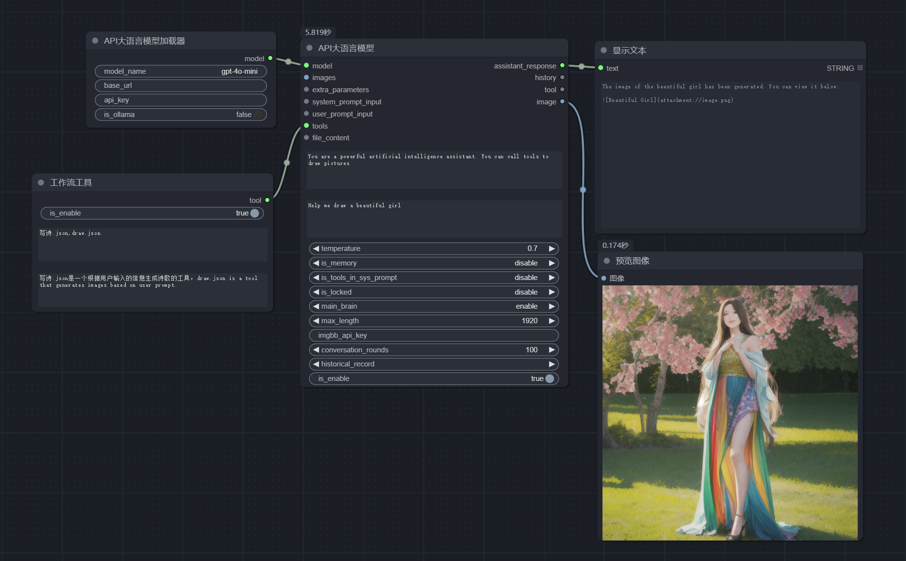

1. You can right-click in the comfyui interface, select `llm` from the context menu, and you will find the nodes for this project. [how to use nodes](https://github.com/heshengtao/Let-LLM-party)
2. Supports API integration or local large model integration. Modular implementation for tool invocation.When entering the base_url, please use a URL that ends with `/v1/`.You can use [ollama](https://github.com/ollama/ollama) to manage your model. Then, enter `http://127.0.0.1:11434/v1/` for the base_url, `ollama` for the api_key, and your model name for the model_name, such as: llama3.
- API access sample workflow: [start_with_LLM_api](workflow/start_with_LLM_api)
- Local model access sample workflow: [start_with_LLM_local](workflow/start_with_LLM_local)
- ollama access sample workflow: [ollama](workflow/ollama.json)
3. Local knowledge base integration with RAG support.sample workflow: [Knowledge Base RAG Search](workflow/知识库RAG搜索.json)
4. Ability to invoke code interpreters.
5. Enables online queries, including Google search support.sample workflow: [movie query workflow](workflow/电影查询工作流.json)
6. Implement conditional statements within ComfyUI to categorize user queries and provide targeted responses.sample workflow: [intelligent customer service](workflow/智能客服.json)
7. Supports looping links for large models, allowing two large models to engage in debates.sample workflow: [Tram Challenge Debate](workflow/电车难题辩论赛.json)
8. Attach any persona mask, customize prompt templates.
9. Supports various tool invocations, including weather lookup, time lookup, knowledge base, code execution, web search, and single-page search.
10. Use LLM as a tool node.sample workflow: [LLM Matryoshka dolls](workflow/LLM套娃.json)
11. Rapidly develop your own web applications using API + Streamlit.
12. Added a dangerous omnipotent interpreter node that allows the large model to perform any task.
13. It is recommended to use the `show_text` node under the `function` submenu of the right-click menu as the display output for the LLM node.
14. Supported the visual features of GPT-4O!sample workflow:[GPT-4o](workflow/GPT-4o.json)
15. A new workflow intermediary has been added, which allows your workflow to call other workflows!sample workflow:[Invoke another workflow](workflow/调用另一个工作流.json)
16. Adapted to all models with an interface similar to OpenAI, such as: Tongyi Qianwen/QWEN, Zhigu Qingyan/GLM, DeepSeek, Kimi/Moonshot. Please fill in the base_url, api_key, and model_name of these models into the LLM node to call them.
17. Added an LVM loader, now you can call the LVM model locally, support [lava-llama-3-8b-v1_1-gguf](https://huggingface.co/xtuner/llava-llama-3-8b-v1_1-gguf) model, other LVM models should theoretically run if they are GGUF format.The example workflow can be found here: [start_with_LVM.json](workflow/start_with_LVM.json).
18. I wrote a `fastapi.py` file, and if you run it directly, you’ll get an OpenAI interface on `http://127.0.0.1:8817/v1/`. Any application that can call GPT can now invoke your comfyui workflow! I will create a tutorial to demonstrate the details on how to do this.
19. I’ve separated the LLM loader and the LLM chain, dividing the model loading and model configuration. This allows for sharing models across different LLM nodes!
20. macOS and mps devices are now supported! Thanks to [bigcat88](https://github.com/bigcat88) for their contribution!
21. You can build your own interactive novel game, and go to different endings according to the user's choice! Example workflow reference: [interactive_novel](workflow/互动小说.json)
22. Adapted to OpenAI's whisper and tts functions, voice input and output can be realized. Example workflow reference: [voice_input&voice_output](workflow/语音输入+语音输出.json)
23. Compatible with [Omost](https://github.com/lllyasviel/Omost)!!! Please download [omost-llama-3-8b-4bits](https://huggingface.co/lllyasviel/omost-llama-3-8b-4bits) to experience it now! Sample workflow reference: [start_with_OMOST](workflow/start_with_OMOST)
24. Added LLM tools to send messages to WeCom, DingTalk, and Feishu, as well as external functions to call.
25. Added a new text iterator, which can output only part of the characters at a time. It is safe to split the text according to Carriage Return and chunk size, and will not be divided from the middle of the text. chunk_overlap refers to how many characters the divided text overlaps. In this way, you can enter super long text in batches, as long as you don't have a brain to click, or open the loop in comfyui to execute, it can be automatically executed. Remember to turn on the is_locked property, which can automatically lock the workflow at the end of the input and will not continue to execute. Example workflow: [text iteration input](workflow/文本迭代输入.json)
26. Added the model name attribute to the local LLM loader, local llava loader. If it is empty, it will be loaded using various local paths in the node. If it is not empty, it will be loaded using the path parameters you fill in yourself in `config.ini`. If it is not empty and not in `config.ini`, it will be downloaded from huggingface or loaded from the model save directory of huggingface. If you want to download from huggingface, please fill in the format of for example: `THUDM/glm-4-9b-chat`.Attention! Models loaded in this way must be adapted to the transformer library.
27. Added JSON file parsing node and JSON value node, which allows you to get the value of a key from a file or text. Thanks to [guobalove](https://github.com/guobalove) for your contribution!
28. Improved the code of tool call. Now LLM without tool call function can also open is_tools_in_sys_prompt attribute (local LLM does not need to be opened by default, automatic adaptation). After opening, the tool information will be added to the system prompt word, so that LLM can call the tool.Related papers on implementation principles: [Achieving Tool Calling Functionality in LLMs Using Only Prompt Engineering Without Fine-Tuning](https://arxiv.org/abs/2407.04997)
29. A new custom_tool folder is created to store the code of the custom tool. You can refer to the code in the [custom_tool](custom_tool) folder, put the code of the custom tool into the custom_tool folder, and you can call the custom tool in LLM.
30. Added Knowledge Graph tool, so that LLM and Knowledge Graph can interact perfectly. LLM can modify Knowledge Graph according to your input, and can reason on Knowledge Graph to get the answers you need. Example workflow reference: [graphRAG_neo4j](workflow/graphRAG_neo4j.json)
31. Added personality AI function, 0 code to develop your own girlfriend AI or boyfriend AI, unlimited dialogue, permanent memory, stable personality. Example workflow reference: [Mylover Personality AI](workflow/麦洛薇人格AI.json)
32. You can use this LLM tool maker to automatically generate LLM tools, save the tool code you generated as a python file, and then copy the code to the custom_tool folder, and then you create a new node. Example workflow: [LLM tool generator](workflow/LLM工具制造机.json).
33. It supports duckduckgo search, but it has significant limitations. It seems that only English keywords can be entered, and multiple concepts cannot appear in keywords. The advantage is that there are no APIkey restrictions.
34. It supports the function of calling multiple knowledge bases separately, and it is possible to specify which knowledge base is used to answer questions in the prompt word. Example workflow: [multiple knowledge bases are called separately](workflow/多知识库分别调用.json).
35. Support LLM input extra parameters, including advanced parameters such as json out. Example workflow: [LLM input extra parameters](workflow/LLM额外参数eg_JSON_OUT.json).[Separate prompt words with json_out](workflow/用json_out分离提示词.json).
36. Added the function of connecting the agent to discord. (still testing)
37. Added the function of connecting the agent to Feishu, thank you very much [guobalove](https://github.com/guobalove) for your contribution! Refer to the workflow [Feishu robot](workflow/飞书机器人.json).
38. Added universal API call node and a large number of auxiliary nodes for constructing the request body and grabbing the information in the response.
39. Added empty model node, you can uninstall LLM from video memory at any location!
40. The [chatTTS](https://github.com/2noise/ChatTTS) node has been added, thank you very much for the contribution of [guobalove](https://github.com/guobalove)! `model_path` parameter can be empty! It is recommended to use `HF` mode to load the model, the model will be automatically downloaded from hugging face, no need to download manually; if using `local` loading, please put the model's`asset` and `config` folders in the root directory. [Baidu cloud address](https://pan.baidu.com/share/init?surl=T4aEB4HumdJ7iVbvsv1vzA&pwd=qyhu), extraction code: qyhu; if using `custom` mode to load, please put the model's `asset` and `config` folders under `model_path`.
2. Updated a series of conversion nodes: markdown to HTML, svg to image, HTML to image, mermaid to image, markdown to Excel.
1. Compatible with the llama3.2 vision model, supports multi-turn dialogue, visual functions. Model address: [meta-llama/Llama-3.2-11B-Vision-Instruct](https://huggingface.co/meta-llama/Llama-3.2-11B-Vision-Instruct). Example workflow: [llama3.2_vision](https://github.com/heshengtao/comfyui_LLM_party/blob/main/workflow_tutorial/LLM_Party%20for%20Llama3.2%20-Vision%EF%BC%88%E5%B8%A6%E8%AE%B0%E5%BF%86%EF%BC%89.json).
1. Adapted GOT-OCR2, supports formatted output results, supports fine text recognition using position boxes and colors. Model address: [GOT-OCR2](https://huggingface.co/stepfun-ai/GOT-OCR2_0). Example workflow converts a screenshot of a webpage into HTML code and then opens the browser to display this webpage: [img2web](workflow/图片转网页.json).
2. The local LLM loader nodes have been significantly adjusted, so you no longer need to choose the model type yourself. The llava loader node and GGUF loader node have been re-added. The model type on the local LLM model chain node has been changed to LLM, VLM-GGUF, and LLM-GGUF, corresponding to directly loading LLM models, loading VLM models, and loading GGUF format LLM models. VLM models and GGUF format LLM models are now supported again. Local calls can now be compatible with more models! Example workflows: [LLM_local](workflow/start_with_LLM_local.json), [llava](workflow/start_with_llava.json), [GGUF](workflow/start_with_GGUF.json)
2. Added EasyOCR node for recognizing text and positions in images. It can generate corresponding masks and return a JSON string for LLM to view. There are standard and premium versions available for everyone to choose from!
2. In the comfyui LLM party, the strawberry system of the chatgpt-o1 series model was reproduced, referring to the prompts of [Llamaberry](https://huggingface.co/spaces/martinbowling/Llamaberry/blob/main/app.py). Example workflow: [Strawberry system compared to o1](workflow/草莓系统与o1对比.json).
2. A new GPT-sovits node has been added, allowing you to call the GPT-sovits model to convert text into speech based on your reference audio. You can also fill in the path of your fine-tuned model (if not filled, the base model will be used for inference) to get any desired voice. To use it, you need to download the [GPT-sovits](https://github.com/RVC-Boss/GPT-SoVITS) project and the corresponding base model locally, then start the API service with `runtime\python.exe api_v2.py` in the GPT-sovits project folder. Additionally, the chatTTS node has been moved to [comfyui LLM mafia](https://github.com/heshengtao/comfyui_LLM_mafia). The reason is that chatTTS has many dependencies, and its license on PyPi is CC BY-NC 4.0, which is a non-commercial license. Even though the chatTTS GitHub project is under the AGPL license, we moved the chatTTS node to comfyui LLM mafia to avoid unnecessary trouble. We hope everyone understands!
3. Now supports OpenAI’s latest model, the o1 series!
4. Added a local file control tool that allows the LLM to control files in your specified folder, such as reading, writing, appending, deleting, renaming, moving, and copying files.Due to the potential danger of this node, it is included in [comfyui LLM mafia](https://github.com/heshengtao/comfyui_LLM_mafia).
5. New SQL tools allow LLM to query SQL databases.
6. Updated the multilingual version of the README. Workflow for translating the README document: [translate_readme](workflow/文档自动翻译机.json)
7. Updated 4 iterator nodes (text iterator, picture iterator, excel iterator, json iterator). The iterator modes are: sequential, random, and infinite. The order will be output in sequence until the index limit is exceeded, the process will be automatically aborted, and the index value will be reset to 0. Random will choose a random index output, and infinite will loop output.
8. Added Gemini API loader node, now compatible with Gemini official API!Since Gemini generates an error with a return code of 500 if the returned parameter contains Chinese characters during the tool call, some tool nodes are unavailable.example workflow:[start_with_gemini](workflow/start_with_gemini.json)
9. Added lore book node, you can insert your background settings when talking to LLM, example workflow: [lorebook](workflow/lorebook.json)
10. Added FLUX prompt word generator mask node, which can generate Hearthstone cards, Game King cards, posters, comics and other styles of prompt words, which can make the FLUX model straight out. Reference workflow: [FLUX prompt word](https://openart.ai/workflows/comfyui_llm_party/flux-by-llm-party/sjME541i68Kfw6Ib0EAD)
1. A new browser tool node has been developed based on [browser-use](https://github.com/gregpr07/browser-use), which allows the LLM to automatically perform the browser tasks you publish.
1. The nodes for loading files, loading folders, loading web content, and all word embedding-related nodes have been upgraded. Now, the file content you load will always include the file name and paragraph index. The loading folder node can filter the files you wish to load through `related_characters`.
1. A local model tool for speech-to-text has been added, which is theoretically compatible with all ASR models on HF. For example: [openai/whisper-small](https://huggingface.co/openai/whisper-small), [nyrahealth/CrisperWhisper](https://huggingface.co/nyrahealth/CrisperWhisper), and so forth.
1. Added ASR and TTS nodes for [fish audio](https://docs.fish.audio/introduction), please refer to the API documentation of fish audio for usage instructions.
1. Added the aisuite loader node, which is compatible with all APIs that aisuite can accommodate, including: ["openai", "anthropic", "aws", "azure", "vertex", "huggingface"]. Example workflow: [start_with_aisuite](workflow/start_with_aisuite.json).
1. A new category has been added: memory nodes, which can be utilized to manage your LLM conversation history. Currently, memory nodes support three modes for managing your conversation history: local JSON files, Redis, and SQL. By decoupling the LLM's conversation history from the LLM itself, you can employ word embedding models to compress and organize your conversation history, thus saving tokens and context windows for the LLM. Example workflow: [External Memory](workflow/外置记忆.json).
1. A local file reading tool has been added. In comparison to the previous local file control tool in ComfyUI LLM Mafia, this tool can only read files or the file tree within a specific folder, thus ensuring greater security.
1. Forked [chatgpt-on-wechat](https://github.com/zhayujie/chatgpt-on-wechat), created a new repository [party-on-wechat](https://github.com/heshengtao/party-on-wechat). The installation and usage methods are the same as the original project, no configuration is required, just start the party's FastAPI. By default, it calls the wx_api workflow and supports image output. It will be updated gradually to ensure a smooth experience of party on WeChat.
2. Added an In-Context-LoRA mask node, used for generating consistent [In-Context-LoRA](https://github.com/ali-vilab/In-Context-LoRA/tree/main) prompts.
1. We have added a frontend component with features laid out from left to right as follows:
   - Saves your API key and Base URL to the `config.ini` file. When you use the `fix node` function on the API LLM loader node, it will automatically read the updated API key and Base URL from the `config.ini` file.
   - Starts a FastAPI service that can be used to call your ComfyUI workflow. If you run it directly, you get an OpenAI interface at `http://127.0.0.1:8817/v1/`. You need to connect the start and end of your workflow to the 'Start Workflow' and 'End Workflow', then save in API format to the `workflow_api` folder. Then, in any frontend that can call the OpenAI interface, input `model name=<your workflow name without the .json extension>`, `Base URL=http://127.0.0.1:8817/v1/`, and the API key can be filled with any value.
   - Starts a Streamlit application; the workflow saving process is as above. You can select your saved workflow in the 'Settings' of the Streamlit app and interact with your workflow agent in the 'Chat'.
   - 'About Us', which introduces this project.
2. The automatic model name list node has been removed and replaced with a simple API LLM loader node, which automatically retrieves your model name list from the configuration in your config.ini file. You just need to select a name to load the model. Additionally, the simple LLM loader, simple LLM-GGUF loader, simple VLM loader, simple VLM-GGUF loader, and simple LLM lora loader nodes have been updated. They all automatically read the model paths from the model folder within the party folder, making it easier for everyone to load various local models.
1. LLMs can now dynamically load lora like SD and FLUX. You can chain multiple loras to load more loras on the same LLM. Example workflow: [start_with_LLM_LORA](workflow/LLM_lora.json).
1. Added the [searxng](https://github.com/searxng/searxng) tool, which can aggregate searches across the entire web. Perplexica also relies on this aggregation search tool, so you can set up a Perplexica at your party. You can deploy the searxng/searxng public image in Docker, then start it using `docker run -d -p 8080:8080 searxng/searxng`, and access it using `http://localhost:8080`. You can fill in this URL `http://localhost:8080` in the party's searxng tool, and then you can use searxng as a tool for LLM.
1. **Major Update!!!** Now you can encapsulate any ComfyUI workflow into an LLM tool node. You can have your LLM control multiple ComfyUI workflows simultaneously. When you want it to complete some tasks, it can choose the appropriate ComfyUI workflow based on your prompt, complete your task, and return the result to you. Example workflow: [comfyui_workflows_tool](workflow/把任意workflow当作LLM_tool.json). The specific steps are as follows:
   - First, connect the text input interface of the workflow you want to encapsulate as a tool to the "user_prompt" output of the "Start Workflow" node. This is where the prompt passed in when the LLM calls the tool.
   - Connect the positions where you want to output text and images to the corresponding input positions of the "End Workflow" node.
   - Save this workflow as an API (you need to enable developer mode in the settings to see this button).
   - Save this workflow to the workflow_api folder of this project.
   - Restart ComfyUI and create a simple LLM workflow, such as: [start_with_LLM_api](workflow/start_with_LLM_api.json).
   - Add a "Workflow Tool" node to this LLM node and connect it to the tool input of the LLM node.
   - In the "Workflow Tool" node, write the name of the workflow file you want to call in the first input box, for example: draw.json. You can write multiple workflow file names. In the second input box, write the function of each workflow so that the LLM understands how to use these workflows.
   - Run it to see the LLM call your encapsulated workflow and return the result to you. If the return is an image, connect the "Preview Image" node to the image output of the LLM node to view the generated image. Note! This method calls a new ComfyUI on your 8190 port, please do not occupy this port. A new terminal will be opened on Windows and Mac systems, please do not close it. The Linux system uses the screen process to achieve this, when you do not need to use it, close this screen process, otherwise, it will always occupy your port.
   
