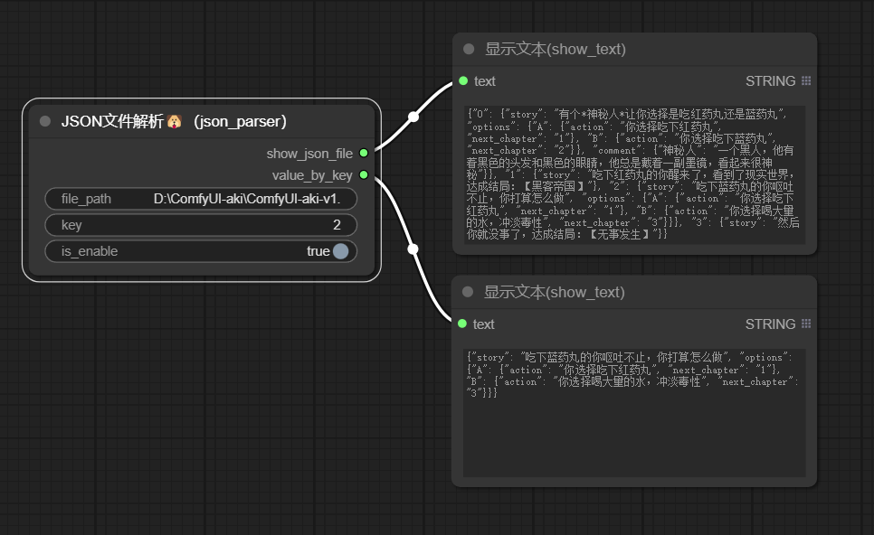
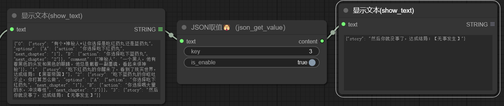
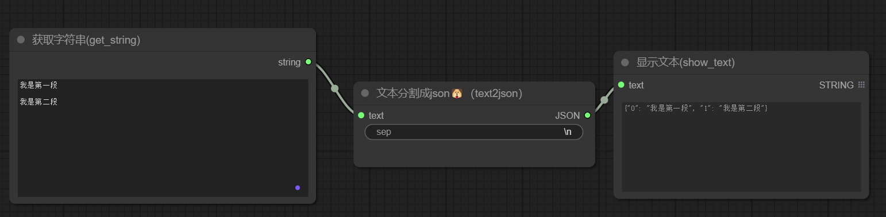
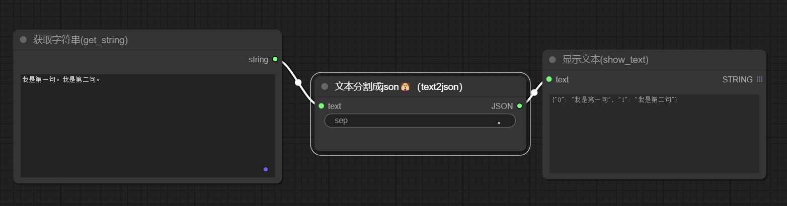
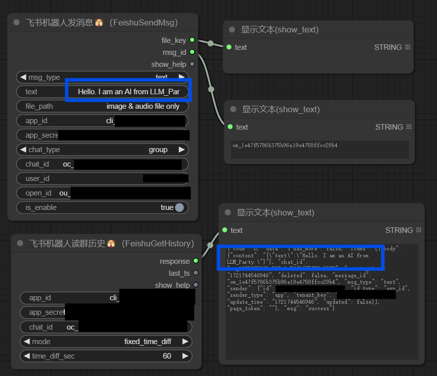

# **Node Usage Instructions**

## Models

### API LLM Nodes and Their Loading Nodes
1. You can directly input system prompts and user prompts on the node, or use `system prompt input` and `user prompt input` to input, accepting string type inputs. `system input` is generally used to mount mask nodes. Essentially, it is no different from an input box.
2. The large model node can also accept the output of tool nodes from the `tools` interface and accept string inputs from the `file_content` interface. These inputs will be used as the model's knowledge base, and relevant content will be searched and input into the model based on word vector similarity.
3. The `is_memory` of the large model node can determine whether the large model has memory. You can change `is_memory` to `disable`, then run it, and the model will clear the previous conversation records. Switch back to `enable`, and the model will retain your conversation records in subsequent runs.
4. You can view the model's response in the current round of conversation through `assistant_response`, and you can also view the history of multiple rounds of conversation through `history`.
5. Even if external parameters remain unchanged, the large model node will always run because the large model always has different answers to the same question.
6. Input:
   - `is_tools_in_sys_prompt`: Determines whether the information of tools will be input into the system prompt. If input into the system prompt, it can unlock tool capabilities for some models without tool capabilities.
   - `is_memory`: When enabled, the LLM gains memory. If not enabled, it will clear memory each time and start over.
   - `is_locked`: When you do not change any parameters, it directly returns the result of the last conversation, saving computing power and stabilizing the output results of the LLM.
   - `main_brain`: Determines whether the large model is the model interfacing with the user. When disabled, the LLM node can be used as a tool for another LLM node.
   - `conversation_rounds`: Determines the number of conversation rounds for the LLM. When the number of rounds is exceeded, only the most recent conversation rounds will be read.
   - `historical_record`: Can load previous conversation records into the LLM to continue the last chat.
   - `tools`: Input is the tool call interface of the LLM, and tool output is the interface for using this LLM node as a tool, generally not used.
   - `Imgbb api key` is optional. If you use visual functions and do not fill in this key, it will be transmitted to OpenAI in base64 encoding. If you add a key, it will generate a URL after uploading to the image bed and pass the URL to OpenAI. Not filling it will not affect usage, but it will affect the readability of the conversation record.
7. Output:
   - `assistant_response`: Text output of the LLM
   - `history`: Conversation records of the LLM
   - `Tool`: Enabled when the LLM is used as a tool for another LLM. In most cases, it can be ignored.
   - `Image`: Under construction, useful in the future.
8. The LLM adapts to GPT-4's visual functions. You can input the `imgbb_api_key` into the [imgbb](https://imgbb.com/) API key. After filling it in, your image will be passed to GPT in URL format. If not filled, it will be passed in image encoding format.
9. The large model node can customize the model name, API_KEY, and base_url. Currently, only OpenAI type API interface calls are supported. It can be combined with One API to connect to any large model API.

### Local LLM Nodes and Their Loading Nodes
1. The local LLM loader node has been greatly adjusted, and you no longer need to choose the model type yourself. The `llava` loader node and `GGUF` loader node have been re-added. The model type on the local LLM model chain node has been changed to three options: `LLM`, `VLM-GGUF`, and `LLM-GGUF`, corresponding to directly loading LLM models, loading VLM models, and loading GGUF format LLM models. Support for VLM models and GGUF format LLM models has been restored. Now local calls can be compatible with more models! Example workflows: `LLM_local`, `llava`, `GGUF`.
2. Fill in the model's project folder in `model_name_or_path`, compatible with all models that can be compatible with transformers. You can also fill in the repo ID on Hugging Face to directly pull the model.
3. The remaining parameters are consistent with the API LLM nodes.

### VLM-GGUF Model Loader
1. ckpt_path and clip_path should be filled with the absolute paths of the LLM’s GGUF file and the CLIP’s GGUF file, respectively.
2. `max_ctx` is the maximum context length of the LVM model. If this length is exceeded, the model will automatically truncate.
3. `gpu_layers` is the number of layers of the LVM model on the GPU.
4. `n_threads` is the number of threads of the LVM model on the CPU.

### LLM-GGUF Model Loader
1. Same as above, but only the absolute path of the LLM’s GGUF file needs to be filled in.

### VLM Local Loader
1. Similar to the LLM local loader, but it only supports models like llama3.2-vision. When using this node to load, you need to set the model type on the model chain to LVM (testing). This loader is still in testing and cannot adapt to many models.

### Embedding Model Loader
1. The `file_content` node can input a string, which will be used as the input of the word embedding model. The model will search this string and return the most relevant text content based on the question.
2. `k` is the number of paragraphs returned. `chuck_size` is the size of each text block when splitting the text, with a default of 200. `chuck_overlap` is the overlap size between each text block when splitting the text, with a default of 50.
3. Input `embedding_path` to call the word embedding model in this folder.

## Other Loaders

### Load_File Node
1. The path to read the file is in comfyui_LLM_party/file, you can put the file you want to read in this path, and then fill in the file name in this node.
2. You can choose absolute path input, in which case path can accept an absolute path.
3. The output is a string that contains all the text information in the file.
4. The adapted file formats are: ".docx", ".txt", ".pdf", ".xlsx", ".csv", ".py", ".js", ".java", ".c", ".cpp", ".html", ".css", ".sql", ".r", ".swift"

### Load_Folder Node
1. folder_path can accept an absolute path of a folder, and this node will automatically read all the files in the folder.
2. The output is a string that contains all the text information in the folder.
3. The adapted file formats are: ".docx", ".txt", ".pdf", ".xlsx", ".csv", ".py", ".js", ".java", ".c", ".cpp", ".html", ".css", ".sql", ".r", ".swift"

### Load_url_content Node
1. Can convert all web page content in a url into an md format output.
2. The output is a string that contains all the text information on the web page.

### Load_Wikipedia Node
1. Can return all content related to the question in Wikipedia.

### Load Model Names
1. Load model names from `config.ini` to facilitate model selection on the loader.

### Load Keyword Retriever
1. Return the most relevant text paragraphs based on the question.
2. `k` is the number of paragraphs returned. `chuck_size` is the size of each text block when splitting the text, with a default of 200. `chuck_overlap` is the overlap size between each text block when splitting the text, with a default of 50.

### Excel Iterator
1. Return the content of the Excel file row by row, facilitating row-by-row processing. Each time `comfyui` runs, it will return the next row's content.
2. Can be used with `comfyui`'s auto-execution to iteratively batch process your work.
3. Input the absolute path of the Excel file you want to process in `path`.
4. `is_reload` determines whether to reset the returned row count.

### Text Iterator
1. Segment the input content and return it segment by segment, facilitating segment-by-segment processing. Each time `comfyui` runs, it will return the next segment's content.
2. Can be used with `comfyui`'s auto-execution to iteratively batch process your work.
3. Input the text content you want to process in `file_content`.
4. `is_reload` determines whether to reset the returned segment count.

### Image Iterator
1. Return images from the folder specified in `folder_path` one by one.
2. Can be used with `comfyui`'s auto-execution to iteratively batch process your work.
3. `is_reload` determines whether to reset the returned index.
4. Supports image formats ".png", ".jpg", ".jpeg", ".gif", ".bmp".

### Google Search Loader
1. Input your `google_api_key` and `cse_id` to use this node to search for relevant content based on `keyword`.
2. Control `paper_num` to turn pages and view later search results.
3. In web search mode, this node will return the top 10 URLs and summaries from Google search.
4. In image search mode, this node will return the top 10 image URLs from Google search.

### Bing Search Loader
1. Input your `bing_api_key` to use this node to search for relevant content based on `keyword`.
2. Control `paper_num` to turn pages and view later search results.
3. In search mode, this node will return the top 10 URLs and summaries from Bing search.
4. In image search mode, this node will return the top 10 image URLs from Bing search.

## Persona

### Classifier persona and Super Large Classifier persona Nodes
1. You can use this persona node as the system_prompt_input of the LLM node, allowing the large model to have the personality of the persona.
2. LLM will classify user_prompt according to the categories described on the classifier persona node.
3. Can be used in conjunction with classifier functions to output different categories of text to different workflows.

### Custom persona
1. prompt is the system_prompt_input that will be input into the LLM node, which can contain some variables, such as: "You are an intelligent customer service about {app}"
2. prompt_template contains the corresponding rules for the variables in the prompt, generally in json format, which can be filled in as follows: {"app":"chatgpt"}, at this time, {app} in the prompt will be automatically replaced with chatgpt.

### Load_Persona Node
1. Can return a preset persona persona, which can be used as the system_prompt_input of the large model, allowing the large model to have the personality of the persona.
2. The persona folder contains the persona of the image prompt assistant and DAN. You can add more personas to this folder for your use.

### Translation persona
1. Translates `language_A` to `language_B`, translating the `user_prompt` into the corresponding language and then returning the translated content.
2. `tone` is the tone, which can be freely specified.
3. `degree` is the degree of translation, ranging from 0 to 10, with the tone becoming progressively stronger.

## Functions

### Classifier Function and Super Large Classifier Function Nodes
1. Can split the string processed by the LLM with a classifier persona into multiple strings, which can be used in conjunction with string logic to control the execution of the corresponding workflow.
2. A model with a high level of intelligence is required to achieve stable classification output. The author of this node does not recommend using it and suggests using string logic and string extraction nodes instead.

### String Logic
1. option contains the following options: "A contain B", "A not contain B", "A relate to B", "A not relate to B", "A equal B", "A not equal B", "A is null", "A is not null" for selection.
2. When the condition is true, if will output A string, else will output an empty string, is_true will output true, is_false will output false, otherwise else will output A string, if will output an empty string, is_true will output false, is_false will output true.

### Text Display Function
1. Can directly display the input string on the comfyui interface.

### Send to WeCom, DingTalk, Feishu
1. Send the input string to WeCom, DingTalk, or Feishu. You need to configure the webhook addresses for Feishu, DingTalk, and WeCom in advance.

### Extract String
1. Extract the desired content from the input string. `substring` will return the content between the first occurrence of `start_string` and `end_string`.
2. `remaining_string` will return the other characters after removing the content between the first occurrence of `start_string` and `end_string`.
3. You can reuse this node to repeatedly extract multiple substrings that meet the criteria from the string.

### OpenAI Text-to-Speech
1. Convert the input string to speech. You need to configure the OpenAI `api_key` in advance.
2. `voice` can control the voice tone. You can refer to the official OpenAI documentation.

### Play Audio
1. Play the input audio file. The input is the absolute path of an audio file.

### Omost Decoder
1. Convert the code output by the Omost model into conditioning and mask.
2. `mode` includes three different fusion modes: `greedy` is the greedy algorithm, `fusion` first fuses conditioning and then fuses the mask by averaging according to weights before decoding, and `block` first fuses conditioning and mask by blocks before decoding.
3. `strength` is the weight of the mask.

### Omost Settings
1. Facilitate users to output relevant code according to their needs. The output can be copied into the code generated by Omost for replacement.

### Listen to Audio
1. Press `press_key` to start listening to audio. Press `release_key` to stop listening and return the path of the recorded audio file.

### OpenAI Speech Recognition
1. Convert the input audio file to text. You need to configure the OpenAI `api_key` in advance.

### Replace String
1. The node will replace `old_string` in `input_string` with `new_string` and return the replaced string.

### CosyVoice Text-to-Speech
1. Convert the input string to speech. Although it is a free interface, it only supports Chinese and is prone to errors, so it is not recommended.

### API Function
1. Fill in the URL of the website to be accessed.
2. Fill in the `api_key` of the API.
3. Fill in the parameters of the API. You need to use the parameter dictionary function to input.

### Parameter Dictionary Function
1. Convert the input `key` and `value` into a dictionary to facilitate the use of the API function.
2. `value` can be a string, dictionary, or list. You can construct any JSON dictionary you want by combining the list and dictionary-related nodes in the combination node.

### Get String
1. Convert the input text to string output.

### Clear Model
1. Connect the two `any` interfaces to any connection line in the workflow.
2. The node will exit the model from memory when it is executed.

### chatTTS Voice Synthesis
**1. Node Input**
Input Name   | Description
-------------|-----
text         | Text to be converted to speech
model_path   | Path to the TTS model
save_path    | Path to save the audio file
seed         | Seed for fixed voice tone
temperature  | Effect similar to LLM
top_P        | Effect similar to LLM
top_K        | Effect similar to LLM
enableRefine | Whether to enable optimization
oral_param   | Parameter to control the degree of orality when optimization is enabled
laugh_param  | Parameter to control the degree of laughter when optimization is enabled
break_param  | Parameter to control the length of pauses when optimization is enabled
is_enable    | Whether to enable this node
load_mode    | **HF**: Download model from Huggingface **custom**: Call model from model_path **local**: Directly call the model file in the current workspace path (usually the root directory of ComfyUI)

**2. Node Output**

Output Name  | Description
-------------|-----
audio        | Path to save the audio file

### JSON File Parsing

1. show_json_file: Read the JSON file and output it as a string
2. value_by_key: Get the value corresponding to the key in the JSON file by setting the parameter key

### JSON Value Extraction

Get the value corresponding to the key in the string by setting the parameter key (the string must be in JSON format, otherwise it cannot be parsed)

### Convert String Paragraph to JSON

The node will split the string based on the input character sep and convert the text to a JSON formatted string

### Feishu Bot Send Message & Feishu Bot Read Group History

Note: There are two modes for reading history
    1. auto: Automatically extract messages sent between two runs of this node. If it keeps calling in this mode and the developer backend call passes, it may be because your local time is not synchronized
    2. fixed_time_diff: Extract messages within the time_diff_sec before the time of running this node

**Prerequisite Work**

1. Create a Feishu Application
    - Create a self-built application at https://open.feishu.cn/app?lang=zh-CN
    - Enter the application to get app_id and app_secret
    - Add application capabilities -> Enable bot application capabilities
    - Permission management -> Messages and groups -> Select the required permissions to open
    - Security settings -> Add the IP of the computer running ComfyUI to the whitelist
    - Publish the bot to make the application effective
2. Get group or user id
    - First, add the created bot to the group or private chat
    - Find the developer documentation for sending messages on the [Feishu development platform](https://open.feishu.cn/document/server-docs/im-v1/message/create)
    - Click to get the token on the right
    - Select receive id type, chat_id corresponds to the group, open_id and user_id correspond to individuals, click to select members, and copy the corresponding id
3. If you need the bot to send voice messages, you need to install ffmpeg on your computer

### File Combination, Super Large File Combination Nodes
1. Used to combine multiple strings into one string.
2. These combination nodes can be nested.

### Tool Combination, Super Large Tool Combination Nodes
1. Used to combine multiple tool nodes into one tool node, then input to the large model.
2. These combination nodes can be nested.

### Parameter Dictionary Combination and Large Parameter Dictionary Combination
1. Used to combine multiple parameter dictionary functions into one parameter dictionary function, then input into the API function.
2. These combination nodes can be nested.

### List Append and Large List Append
1. Used to combine multiple elements into one list, then input into the parameter dictionary function.
2. These combination nodes can be nested.

### List Extend and Large List Extend
1. Used to combine multiple lists into one list, then input into the parameter dictionary function.
2. These combination nodes can be nested.

## Tools

### Time_Tool, Weather_Tool, AccuWeather_Tool
1. Used for querying time and weather. The time tool node can change the default time zone for queries, and the weather tool node will also add an option to change the default region in the future (this free weather tool is limited to searching for weather in China).
2. The AccuWeather tool node requires an AccuWeather API key to query global weather.

### Google_Tool
1. You can use this node by entering your Google API key and CSE ID.
2. This node will return the top 10 URLs and summaries from Google search. You can ask the model to paginate to see later search results.

### check_web_Tool
1. You can enter the URL you want to search into this node as the default URL for the model's search. This node will convert all content of this webpage into Markdown format and return it to the model.
2. Since requests are not omnipotent, some URLs may not allow crawling, and this project does not provide malicious crawler code.
3. You can input an embedding_path, which will call the word embedding model in this folder. The tool will split the webpage content according to chuck_size and chuck_overlap, returning only the text information related to the user's question.
4. If there is no embedding_path, it will return all content of the webpage.

### Embeddings_Tool
1. The specific function is the same as the word embedding model node, but this node is a tool for LLM, which can be called when the model thinks it needs to query the knowledge base, using the file_content input into this tool.

### Interpreter
1. Allows the large model to generate Python code, run it automatically, and obtain the results of the code execution.
2. Currently, only supports Python code.

### Omnipotent_Interpreter
1. Allows the large model to do anything. The large model will download the required third-party libraries in a virtual environment and then execute the generated code.
2. Please use this tool carefully, as the large model will gain the ability to control your computer to do anything!

### API_Tool
1. Fill in the URL that needs to be accessed.
2. The first text input box is for entering the function of this API tool, for example: a tool for checking the weather.
3. The second text input box is for entering the parameters of this API tool, for example: the parameters for the weather-checking tool are: {"city":"beijing"}

### Wikipedia_Tool
1. Allows the large model to query content related to Wikipedia.
2. You can input an embedding_path, which will call the word embedding model in this folder. The tool will split the Wikipedia content according to chuck_size and chuck_overlap, returning only the text information related to the user's question.
3. If there is no embedding_path, it will return the first 1000 characters related to Wikipedia.

### arXiv_Tool
1. Allows the large model to query relevant research papers on arXiv.
2. The default search is for the research direction in the query.

### Workflow Tool
1. Use a `comfyui` workflow as a tool.
2. This node is under construction and may not work properly.

### GitHub Tool
1. Allow the large model to access GitHub repositories. You need to input the GitHub `APIkey`.

### WeCom, DingTalk, Feishu Tool
1. Allow the large model to send messages to WeCom, DingTalk, and Feishu. You need to configure the webhook addresses for Feishu, DingTalk, and WeCom in advance.

### Keyword Search Tool
1. Allow the large model to access the database using keyword technology for quick RAG.
2. `k` is the number of paragraphs returned. `chuck_size` is the size of each text block when splitting the text, with a default of 200. `chuck_overlap` is the overlap size between each text block when splitting the text, with a default of 50.

### Story JSON Tool
1. Interact with JSON files in the `file` folder to achieve text-based interactive games.

### Knowledge Graph Related Node Package
1. Allow the LLM to interact with the knowledge graph.
2. The developer version can query, add, delete, and modify entities and relationships in the knowledge graph. The regular version can only query entities and relationships in the knowledge graph.
3. The user version can only query entities and relationships in the knowledge graph and cannot add, delete, or modify entities and relationships in the knowledge graph.

### Day of the Week Query Tool
1. Allow the large model to query the current day of the week in any time zone.
2. You can change the default time zone for the query. The default time zone is Asia/Shanghai.

## Workflow Nodes

### Start_Workflow and End_Workflow Nodes
1. You can use these two nodes to define the start and end points of the workflow, placing your workflow in the workflow subfolder of this project folder.
2. Click setup_streamlit_app.bat in the project folder, and in the Streamlit interface, click settings and replace it with your workflow.
3. This way, you quickly build an AI application with Streamlit as the frontend.

### Start_Dialog Node and End_Dialog Node
1. Both of these nodes have a dialog_id, connecting the dialog_id to make them a dialogue archive point. When you need to loop-connect two large models, although it cannot be achieved in comfyui, you can save the output of the latter model locally, and then pass it to the previous model the next time it runs. You can call comfyui with the comfyui API in other frontends, and as long as you keep calling, you can see the infinite self-dialogue of the two models.
2. The start dialogue node has an interface for starting a dialogue, which can serve as a prompt given by the user at the start of a dialogue, guiding the large model to discuss within the topic given by the user.

### Workflow_transfer Node
1. Allows your workflow to call other workflows!
2. Add start workflow and end workflow nodes to the beginning and end of the workflow you want to embed, and save this workflow as an API in the workflow_api folder of the comfyui_LLM_party project.
3. Open another workflow, use the workflow switch node in this workflow, select the workflow you want to embed, and it's done.
4. The first time you use the workflow switch node, another 8189 port will be opened, please do not close this new console.

## Image

### Party Versions of CLIP Text Encoder, Sampler, Decoder
1. These nodes have been modified by me so that they will not error out when input is missing, but will be bypassed instead. I think this feature is very important, but I don't know why comfyui doesn't write this feature. This feature can control which part of the workflow is executed by controlling whether there is input to the workflow.
